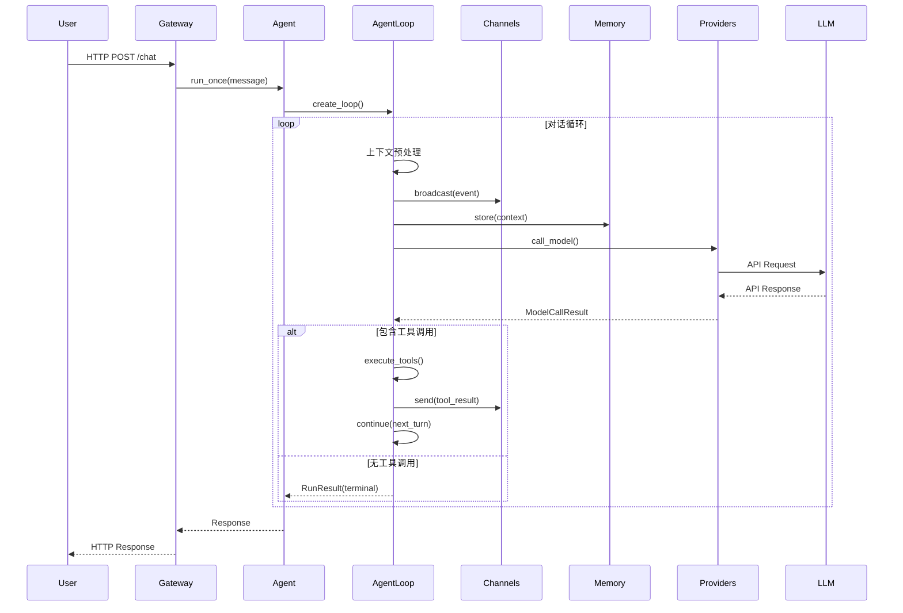

# 架构设计文档

本文档详细描述 MonkeyCode AI Agent 框架的架构设计，包括核心组件、数据流、设计模式和扩展机制。

## 1. 整体架构

### 1.1 分层架构

系统采用清晰的分层架构设计：

```
┌─────────────────────────────────────────────────────────────┐
│                    外部接口层 (Interface Layer)               │
│  ┌─────────────────┐  ┌──────────────────────────────────┐  │
│  │    Gateway      │  │         CLI / IDE Integration     │  │
│  │  (HTTP/WebSocket)│  │                                   │  │
│  └────────┬────────┘  └──────────────────────────────────┘  │
├───────────┼─────────────────────────────────────────────────┤
│           │              核心 Agent 层 (Core Layer)           │
│  ┌────────▼────────┐  ┌─────────────────┐  ┌─────────────┐  │
│  │     Agent       │  │   AgentLoop     │  │    State    │  │
│  │  (生命周期管理)  │  │ (对话主循环)    │  │  (状态机)   │  │
│  └────────┬────────┘  └────────┬────────┘  └─────────────┘  │
├───────────┼────────────────────┼────────────────────────────┤
│           │                    │         支撑模块层          │
│  ┌────────▼────────┐  ┌────────▼────────┐  ┌─────────────┐  │
│  │    Channels     │  │     Context     │  │    Tools    │  │
│  │  (消息通道)     │  │   (上下文压缩)  │  │  (工具系统) │  │
│  └────────┬────────┘  └─────────────────┘  └─────────────┘  │
│  ┌────────▼────────┐  ┌─────────────────┐  ┌─────────────┐  │
│  │    Memory       │  │    Plugins      │  │  Providers  │  │
│  │  (记忆存储)     │  │   (插件系统)    │  │ (服务提供)  │  │
│  └─────────────────┘  └─────────────────┘  └─────────────┘  │
├─────────────────────────────────────────────────────────────┤
│                    外部服务层 (External Services)             │
│  ┌─────────────┐  ┌─────────────┐  ┌─────────────────────┐  │
│  │ LLM APIs    │  │  Database   │  │  External Services  │  │
│  │ (Anthropic) │  │  (SQLite)   │  │  (File System, etc) │  │
│  └─────────────┘  └─────────────┘  └─────────────────────┘  │
└─────────────────────────────────────────────────────────────┘
```

### 1.2 数据流



## 2. 核心组件设计

### 2.1 Agent 组件

`Agent` 是框架的核心入口点，负责：

- 生命周期管理（初始化、运行、暂停、恢复、停止）
- 工具注册和管理
- 依赖注入配置
- 对话循环创建

#### 状态机

```rust
pub enum AgentStatus {
    Initializing,  // 初始化中
    Running,       // 运行中
    Paused,        // 暂停中
    Stopped,       // 已停止
}
```

#### 核心结构

```rust
pub struct Agent {
    config: AgentConfig,
    status: Arc<RwLock<AgentStatus>>,
    tool_registry: Arc<RwLock<ToolRegistry>>,
    deps: Arc<dyn QueryDeps>,
    context_manager: ContextManager,
}
```

### 2.2 AgentLoop 对话循环

`AgentLoop` 实现核心的 `while(true)` 对话循环，采用异步生成器模式。

#### 循环结构

```rust
pub async fn run(&mut self) -> Result<RunResult> {
    loop {
        // 1. 检查终止条件
        if self.state.turn_count >= self.config.max_turns {
            return Ok(RunResult { terminal: ..., ... });
        }

        // 2. 状态初始化
        let current_turn = self.state.turn_count;
        let messages = self.state.messages.clone();

        // 3. 上下文预处理（七步管线）
        let pipeline_result = self.context_manager
            .process_full_pipeline(messages, ...).await?;

        // 4. API 调用
        let call_result = self.deps.call_model(params).await?;

        // 5. 工具调用检测
        let tool_use_blocks = call_result.assistant_message.tool_use_blocks();
        
        if tool_use_blocks.is_empty() {
            // 无工具调用，终止
            return Ok(RunResult { terminal: ..., ... });
        }

        // 6. 执行工具调用
        // ...

        // 7. 状态转换，继续下一轮
        self.state = self.state.next(ContinueReason::NextTurn, ...);
    }
}
```

### 2.3 State 状态机

状态机采用**不可变设计**，每次转换都创建新实例。

#### 状态结构

```rust
pub struct State {
    pub messages: Vec<Message>,
    pub tool_context: ToolContext,
    pub auto_compact_state: AutoCompactState,
    pub output_token_recovery_count: usize,
    pub has_tried_reactive_compact: bool,
    pub output_token_override: Option<usize>,
    pub pending_tool_summary: Option<String>,
    pub stop_hook_active: bool,
    pub turn_count: usize,
    pub transition: TransitionState,
}
```

#### 状态转换

```rust
impl State {
    /// 创建初始状态
    pub fn initial(messages: Vec<Message>) -> Self { ... }

    /// 创建下一个状态（用于 continue）
    pub fn next(&self, transition: ContinueReason, messages: Vec<Message>) -> Self {
        Self {
            messages,
            tool_context: self.tool_context.clone(),
            // ... 复制其他字段
            turn_count: self.turn_count + 1,  // 轮次递增
            transition: TransitionState {
                reason: Some(transition),
                metadata: serde_json::Value::Null,
            },
        }
    }
}
```

#### 终止原因枚举

```rust
pub enum TerminalReason {
    Completed,           // 正常完成
    AbortedStreaming,    // 流式输出被中断
    AbortedTools,        // 工具执行被中断
    MaxTurns,            // 达到最大轮数
    BlockingLimit,       // Token 超限
    PromptTooLong,       // 上下文过长
    ModelError,          // API 调用异常
    StopHookPrevented,   // Stop hook 阻止
    HookStopped,         // Hook 停止
    ImageError,          // 图片错误
    OutputTokenExhausted,// 输出 token 耗尽
    ToolExecutionFailed, // 工具执行失败
}
```

#### 继续原因枚举

```rust
pub enum ContinueReason {
    NextTurn,                // 正常下一轮
    MaxOutputTokensRecovery, // 输出被截断，注入恢复消息
    MaxOutputTokensEscalate, // 首次截断提升限制
    ReactiveCompactRetry,    // 响应式压缩恢复
    CollapseDrainRetry,      // 上下文折叠溢出恢复
    StopHookBlocking,        // Stop hook 阻塞错误
    TokenBudgetContinuation, // Token 预算触发
    ToolRetry,               // 工具执行失败重试
    AttachmentInjection,     // 附件注入后继续
}
```

### 2.4 依赖注入系统

通过 `QueryDeps` trait 实现依赖注入，便于测试和扩展。

#### 依赖接口

```rust
#[async_trait]
pub trait QueryDeps: Send + Sync {
    /// 调用模型 API
    async fn call_model(&self, params: ModelCallParams) -> Result<ModelCallResult>;

    /// 执行 MicroCompact（轻量级压缩）
    async fn micro_compact(&self, messages: Vec<Message>) -> Result<CompactResult>;

    /// 执行 AutoCompact（全量压缩）
    async fn auto_compact(&self, messages: Vec<Message>) -> Result<CompactResult>;

    /// 生成 UUID
    fn generate_uuid(&self) -> String;
}
```

#### 生产环境实现

```rust
pub struct ProductionDeps {
    pub uuid_generator: Box<dyn UuidGenerator>,
}

#[async_trait]
impl QueryDeps for ProductionDeps {
    async fn call_model(&self, _params: ModelCallParams) -> Result<ModelCallResult> {
        // TODO: 实现真实的 Anthropic API 调用
        anyhow::bail!("Model call not implemented")
    }
    // ... 其他方法
}
```

#### 测试环境实现

```rust
pub struct TestDeps {
    pub call_model_fn: Box<dyn Fn(ModelCallParams) -> Result<ModelCallResult> + Send + Sync>,
    pub micro_compact_fn: Box<dyn Fn(Vec<Message>) -> Result<CompactResult> + Send + Sync>,
    pub auto_compact_fn: Box<dyn Fn(Vec<Message>) -> Result<CompactResult> + Send + Sync>,
    pub generate_uuid_fn: Box<dyn Fn() -> String + Send + Sync>,
}

#[async_trait]
impl QueryDeps for TestDeps {
    async fn call_model(&self, params: ModelCallParams) -> Result<ModelCallResult> {
        (self.call_model_fn)(params)
    }
    // ... 其他方法
}
```

### 2.5 上下文压缩管线

七步压缩策略按顺序执行，确保上下文在 Token 限制内。


#### 各步骤说明

| 步骤 | 方法 | 说明 | 阈值 |
|------|------|------|------|
| 1 | `budget_tool_results()` | 对过大的工具结果进行截断或持久化到磁盘 | 10000 tokens |
| 2 | `snip_compress()` | 最粗暴的压缩方式，直接截断消息内容 | 5000 tokens |
| 3 | `micro_compact()` | 轻量压缩，利用缓存编辑技术复用 API 侧缓存 | - |
| 4 | `context_collapse()` | 细粒度压缩，将连续消息折叠为紧凑视图 | 50000 tokens |
| 5 | `assemble_system_prompt()` | 组装系统提示，添加动态上下文 | - |
| 6 | `auto_compact()` | 全量摘要，将历史对话摘要为压缩消息 | 100000 tokens |
| 7 | `estimate_tokens()` | Token 估算和阻断检查 | max_tokens |

#### 管线配置

```rust
pub struct ContextPipelineConfig {
    pub enable_tool_result_budget: bool,
    pub max_tool_result_tokens: usize,
    pub enable_snip: bool,
    pub snip_threshold: usize,
    pub enable_micro_compact: bool,
    pub enable_context_collapse: bool,
    pub collapse_threshold: usize,
    pub enable_auto_compact: bool,
    pub auto_compact_threshold: usize,
}
```

### 2.6 工具系统

工具系统提供可扩展的工具注册、权限控制和执行机制。

#### 工具接口

```rust
#[async_trait]
pub trait Tool: Send + Sync {
    fn name(&self) -> &str;
    fn description(&self) -> &str;
    fn input_schema(&self) -> serde_json::Value;
    fn permission_level(&self) -> ToolPermissionLevel { ... }
    fn concurrency_safe(&self) -> bool { ... }
    async fn execute(&self, input: serde_json::Value, ctx: &ToolContext) -> Result<ToolResult>;
}
```

#### 权限级别

```rust
pub enum ToolPermissionLevel {
    ReadOnly,            // 只读操作，无需确认
    RequiresConfirmation, // 可能产生副作用，需要确认
    Destructive,         // 破坏性操作，严格受限
}
```

#### 工具注册表

```rust
pub struct ToolRegistry {
    tools: HashMap<String, Box<dyn Tool>>,
}

impl ToolRegistry {
    pub fn register<T: Tool + 'static>(&mut self, tool: T) -> Result<()> { ... }
    pub fn get(&self, name: &str) -> Option<&Box<dyn Tool>> { ... }
    pub fn list_tools(&self) -> Vec<ToolMetadata> { ... }
}
```

#### 工具执行器

```rust
pub struct ToolExecutor {
    max_concurrency: usize,  // 最大并行度
}

impl ToolExecutor {
    /// 执行单个工具
    pub async fn execute_tool(&self, tool: &dyn Tool, input: serde_json::Value, ctx: &ToolContext) -> Result<ToolResult> { ... }

    /// 批量执行工具（支持并发控制）
    pub async fn execute_batch(&self, tools: Vec<(&dyn Tool, serde_json::Value)>, ctx: &ToolContext) -> Vec<Result<ToolResult>> { ... }
}
```

## 3. 消息类型系统

### 3.1 消息枚举

```rust
#[derive(Debug, Clone, Serialize, Deserialize)]
#[serde(tag = "role")]
pub enum Message {
    #[serde(rename = "user")]
    User(UserMessage),
    #[serde(rename = "assistant")]
    Assistant(AssistantMessage),
    #[serde(skip)]
    System(SystemMessage),
    #[serde(rename = "tool_summary")]
    ToolSummary(ToolUseSummaryMessage),
    #[serde(skip)]
    Tombstone(TombstoneMessage),
    #[serde(rename = "attachment")]
    Attachment(AttachmentMessage),
    #[serde(rename = "progress")]
    Progress(ProgressMessage),
}
```

### 3.2 内容块类型

```rust
#[derive(Debug, Clone, Serialize, Deserialize)]
#[serde(tag = "type")]
pub enum ContentBlock {
    #[serde(rename = "text")]
    Text { text: String },
    
    #[serde(rename = "tool_use")]
    ToolUse {
        id: String,
        name: String,
        input: serde_json::Value,
    },
    
    #[serde(rename = "tool_result")]
    ToolResult {
        tool_use_id: String,
        content: String,
        is_error: bool,
    },
    
    #[serde(rename = "thinking")]
    Thinking { text: String },
}
```

## 4. 设计模式

### 4.1 异步生成器模式

`AgentLoop` 使用异步生成器模式实现对话循环：

- **流式输出**：支持边生成边输出
- **可取消性**：可以随时中断循环
- **背压控制**：通过状态转换控制生成速度

### 4.2 不可变状态模式

状态机采用不可变设计：

- 每次转换创建新实例
- 状态历史可追踪
- 线程安全，无需锁

### 4.3 策略模式

上下文压缩使用策略模式：

- 多种压缩策略可配置
- 支持运行时切换
- 易于添加新策略

### 4.4 工厂模式

`AgentConfigBuilder` 使用建造者模式：

```rust
let config = AgentConfigBuilder::new()
    .name("my-agent")
    .model("claude-sonnet-4-20250514")
    .max_turns(50)
    .enable_streaming_tools(true)
    .build();
```

## 5. 线程安全设计

### 5.1 异步锁使用

```rust
// Agent 状态
status: Arc<RwLock<AgentStatus>>

// 工具注册表
tool_registry: Arc<RwLock<ToolRegistry>>
```

### 5.2 通道使用

```rust
// 广播通道（多订阅者）
broadcast_tx: broadcast::Sender<Message>

// 点对点通道
mpsc_tx: mpsc::Sender<Message>
```

## 6. 错误处理

### 6.1 错误类型

使用 `anyhow::Result` 和 `thiserror` 进行错误处理：

```rust
use anyhow::Result;
use thiserror::Error;

#[derive(Error, Debug)]
pub enum AgentError {
    #[error("Model API error: {0}")]
    ModelApi(#[from] reqwest::Error),
    
    #[error("Tool execution error: {0}")]
    ToolExecution(String),
    
    #[error("Token limit exceeded: {current} > {max}")]
    TokenLimit { current: usize, max: usize },
}
```

### 6.2 错误传播

使用 `?` 操作符进行错误传播：

```rust
pub async fn run(&mut self) -> Result<RunResult> {
    let pipeline_result = self.context_manager
        .process_full_pipeline(...).await?;  // 传播错误
    
    let call_result = self.deps.call_model(params).await?;  // 传播错误
    
    // ...
}
```

## 7. 扩展机制

### 7.1 插件扩展

通过 `plugins` crate 实现插件系统：

```rust
#[async_trait]
pub trait Plugin: Send + Sync {
    fn metadata(&self) -> PluginMetadata;
    async fn initialize(&mut self) -> Result<()> { ... }
    async fn execute(&self, ctx: PluginContext) -> Result<PluginResult>;
    async fn shutdown(&self) -> Result<()> { ... }
}
```

### 7.2 服务提供者

通过 `providers` crate 实现服务提供者：

```rust
#[async_trait]
pub trait Provider: Send + Sync {
    fn provider_type(&self) -> ProviderType;
    async fn initialize(&self) -> Result<()>;
    async fn call(&self, input: serde_json::Value) -> Result<serde_json::Value>;
    async fn shutdown(&self) -> Result<()> { ... }
}
```

### 7.3 工具扩展

实现自定义工具：

```rust
struct MyCustomTool;

#[async_trait]
impl Tool for MyCustomTool {
    fn name(&self) -> &str { "my_tool" }
    fn description(&self) -> &str { "描述" }
    fn input_schema(&self) -> serde_json::Value { ... }
    
    async fn execute(&self, input: serde_json::Value, ctx: &ToolContext) -> Result<ToolResult> {
        // 自定义逻辑
    }
}
```

## 8. 性能优化

### 8.1 缓存策略

- **MicroCompact**：复用 API 侧已缓存的 token
- **消息引用**：使用 `Arc` 共享大对象

### 8.2 并发控制

- **工具并发执行**：`ToolExecutor` 支持批量并发
- **异步 IO**：全链路异步非阻塞

### 8.3 内存管理

- **短长期记忆分离**：ShortTermMemory 有容量限制
- **自动清理**：超出容量时自动移除最旧条目
