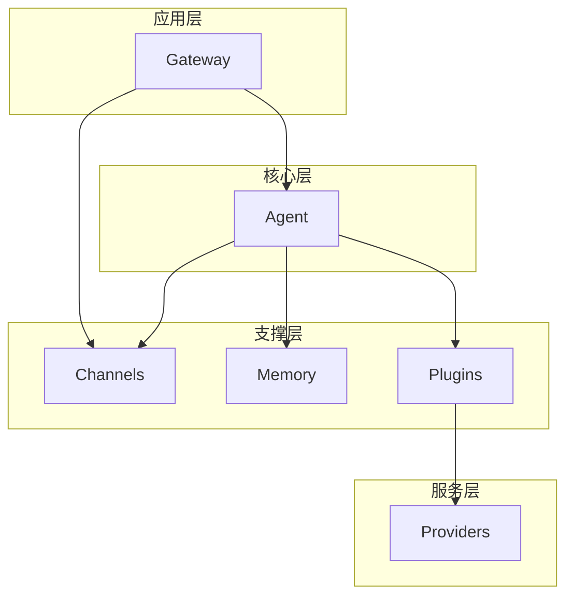

# Crate 参考文档

本文档详细介绍项目中各 crate 的职责、API 和使用方法。

## Crate 总览

| Crate | 版本 | 依赖 | 职责 |
|-------|------|------|------|
| `channels` | 0.1.0 | 无 | 消息通道和通信机制 |
| `memory` | 0.1.0 | 无 | 短期/长期记忆存储 |
| `plugins` | 0.1.0 | 无 | 插件接口和管理器 |
| `providers` | 0.1.0 | plugins | 外部服务提供者实现 |
| `agent` | 0.1.0 | channels, memory, plugins | 核心 Agent 逻辑 |
| `gateway` | 0.1.0 | channels, agent | HTTP API 网关 |

---

## channels

消息通道 crate，提供组件间的通信机制。

### 职责

- 提供广播通道（一对多）
- 提供点对点通道（一对一）
- 消息类型定义和序列化

### 核心 API

#### Message 枚举

```rust
pub enum Message {
    /// 文本消息
    Text(String),
    /// 命令消息
    Command { name: String, args: Vec<String> },
    /// 事件消息
    Event { event_type: String, data: serde_json::Value },
}
```

#### ChannelManager

```rust
pub struct ChannelManager {
    broadcast_tx: broadcast::Sender<Message>,
    mpsc_tx: mpsc::Sender<Message>,
}

impl ChannelManager {
    /// 创建新的通道管理器
    pub fn new(buffer_size: usize) -> Self;
    
    /// 广播消息给所有订阅者
    pub fn broadcast(&self, message: Message) -> Result<()>;
    
    /// 发送点对点消息
    pub async fn send(&self, message: Message) -> Result<()>;
    
    /// 获取广播通道接收者
    pub fn subscribe(&self) -> broadcast::Receiver<Message>;
    
    /// 获取点对点通道接收者
    pub fn receiver(&self) -> mpsc::Receiver<Message>;
}
```

### 使用示例

```rust
use channels::{ChannelManager, Message};

// 创建通道管理器
let manager = ChannelManager::new(100);

// 订阅广播通道
let mut subscriber = manager.subscribe();

// 广播消息
manager.broadcast(Message::Text("Hello".to_string()))?;

// 接收消息
while let Ok(msg) = subscriber.recv().await {
    println!("Received: {:?}", msg);
}
```

---

## memory

记忆存储 crate，管理 Agent 的短期和长期记忆。

### 职责

- 短期记忆存储（带容量限制）
- 长期记忆存储（持久化）
- 记忆检索和搜索

### 核心 API

#### MemoryEntry

```rust
pub struct MemoryEntry {
    pub id: String,
    pub content: String,
    pub timestamp: u64,
    pub tags: Vec<String>,
}
```

#### ShortTermMemory

```rust
pub struct ShortTermMemory {
    entries: RwLock<HashMap<String, MemoryEntry>>,
    max_capacity: usize,
}

impl ShortTermMemory {
    /// 创建新的短期记忆存储
    pub fn new(max_capacity: usize) -> Self;
    
    /// 添加记忆条目（超出容量时自动移除最旧）
    pub async fn add(&self, entry: MemoryEntry) -> Result<()>;
    
    /// 获取记忆条目
    pub async fn get(&self, id: &str) -> Option<MemoryEntry>;
    
    /// 删除记忆条目
    pub async fn remove(&self, id: &str) -> Result<()>;
    
    /// 获取所有记忆
    pub async fn get_all(&self) -> Vec<MemoryEntry>;
    
    /// 清空所有记忆
    pub async fn clear(&self);
}
```

#### LongTermMemory

```rust
pub struct LongTermMemory {
    entries: RwLock<HashMap<String, MemoryEntry>>,
}

impl LongTermMemory {
    /// 创建新的长期记忆存储
    pub fn new() -> Self;
    
    /// 存储记忆
    pub async fn store(&self, entry: MemoryEntry) -> Result<()>;
    
    /// 检索记忆
    pub async fn retrieve(&self, id: &str) -> Option<MemoryEntry>;
    
    /// 按标签搜索记忆
    pub async fn search_by_tags(&self, tags: &[String]) -> Vec<MemoryEntry>;
}
```

#### MemoryManager

```rust
pub struct MemoryManager {
    short_term: ShortTermMemory,
    long_term: LongTermMemory,
}

impl MemoryManager {
    pub fn new(short_term_capacity: usize) -> Self;
    pub fn short_term(&self) -> &ShortTermMemory;
    pub fn long_term(&self) -> &LongTermMemory;
}
```

### 使用示例

```rust
use memory::{MemoryManager, MemoryEntry};

let manager = MemoryManager::new(100);

// 添加短期记忆
let entry = MemoryEntry {
    id: "mem-1".to_string(),
    content: "用户喜欢中文回复".to_string(),
    timestamp: 1234567890,
    tags: vec!["preference".to_string()],
};
manager.short_term().add(entry).await?;

// 检索记忆
let memory = manager.short_term().get("mem-1").await;

// 长期存储
manager.long_term().store(entry.clone()).await?;
```

---

## plugins

插件系统 crate，提供可扩展的插件机制。

### 职责

- 定义插件接口
- 插件注册和管理
- 插件生命周期管理

### 核心 API

#### PluginMetadata

```rust
pub struct PluginMetadata {
    pub name: String,
    pub version: String,
    pub description: String,
    pub author: Option<String>,
}
```

#### PluginContext

```rust
pub struct PluginContext {
    pub request_id: String,
    pub input: serde_json::Value,
    pub env: HashMap<String, String>,
}
```

#### PluginResult

```rust
pub struct PluginResult {
    pub success: bool,
    pub output: Option<serde_json::Value>,
    pub error: Option<String>,
}
```

#### Plugin Trait

```rust
#[async_trait]
pub trait Plugin: Send + Sync {
    /// 获取插件元数据
    fn metadata(&self) -> PluginMetadata;

    /// 初始化插件
    async fn initialize(&mut self) -> Result<()> { Ok(()) }

    /// 执行插件功能
    async fn execute(&self, ctx: PluginContext) -> Result<PluginResult>;

    /// 关闭插件
    async fn shutdown(&self) -> Result<()> { Ok(()) }
}
```

#### PluginManager

```rust
pub struct PluginManager {
    plugins: RwLock<HashMap<String, PluginRegistration>>,
}

impl PluginManager {
    pub fn new() -> Self;
    
    /// 注册插件
    pub async fn register<T: Plugin + 'static>(&mut self, plugin: T) -> Result<()>;
    
    /// 获取插件
    pub async fn get_plugin(&self, name: &str) -> Option<&Box<dyn Plugin>>;
    
    /// 执行插件
    pub async fn execute_plugin(&self, name: &str, ctx: PluginContext) -> Result<PluginResult>;
    
    /// 列出所有插件
    pub async fn list_plugins(&self) -> Vec<PluginMetadata>;
    
    /// 卸载插件
    pub async fn unregister(&mut self, name: &str) -> Result<()>;
    
    /// 初始化所有插件
    pub async fn initialize_all(&mut self) -> Result<()>;
    
    /// 关闭所有插件
    pub async fn shutdown_all(&self) -> Result<()>;
}
```

### 使用示例

```rust
use plugins::{PluginManager, Plugin, PluginContext, PluginMetadata, PluginResult};

struct MyPlugin;

#[async_trait]
impl Plugin for MyPlugin {
    fn metadata(&self) -> PluginMetadata {
        PluginMetadata {
            name: "my-plugin".to_string(),
            version: "1.0.0".to_string(),
            description: "My custom plugin".to_string(),
            author: Some("Developer".to_string()),
        }
    }

    async fn execute(&self, ctx: PluginContext) -> Result<PluginResult> {
        Ok(PluginResult {
            success: true,
            output: Some(ctx.input),
            error: None,
        })
    }
}

// 使用插件管理器
let mut manager = PluginManager::new();
manager.register(MyPlugin).await?;

let ctx = PluginContext {
    request_id: "req-1".to_string(),
    input: serde_json::json!({"key": "value"}),
    env: HashMap::new(),
};

let result = manager.execute_plugin("my-plugin", ctx).await?;
```

---

## providers

服务提供者 crate，实现各种外部服务的提供者。

### 职责

- LLM 服务提供者
- 数据库服务提供者
- 存储服务提供者
- API 服务提供者

### 核心 API

#### ProviderType

```rust
pub enum ProviderType {
    Llm { name: String },
    Database { name: String },
    Storage { name: String },
    Api { name: String },
}
```

#### ProviderConfig Trait

```rust
pub trait ProviderConfig: Send + Sync {
    fn name(&self) -> &str;
    fn validate(&self) -> Result<()>;
}
```

#### Provider Trait

```rust
#[async_trait]
pub trait Provider: Send + Sync {
    fn provider_type(&self) -> ProviderType;
    async fn initialize(&self) -> Result<()>;
    async fn call(&self, input: serde_json::Value) -> Result<serde_json::Value>;
    async fn shutdown(&self) -> Result<()> { Ok(()) }
}
```

#### LlmProviderConfig

```rust
pub struct LlmProviderConfig {
    pub name: String,
    pub api_key: String,
    pub endpoint: String,
    pub model: String,
}
```

#### LlmProvider

```rust
pub struct LlmProvider {
    config: LlmProviderConfig,
}

impl LlmProvider {
    pub fn new(config: LlmProviderConfig) -> Result<Self>;
}

#[async_trait]
impl Provider for LlmProvider {
    fn provider_type(&self) -> ProviderType { ... }
    async fn initialize(&self) -> Result<()> { ... }
    async fn call(&self, input: serde_json::Value) -> Result<serde_json::Value> { ... }
}
```

#### DatabaseProviderConfig

```rust
pub struct DatabaseProviderConfig {
    pub name: String,
    pub connection_string: String,
    pub max_connections: u32,
}
```

#### ProviderRegistry

```rust
pub struct ProviderRegistry {
    providers: HashMap<String, Box<dyn Provider>>,
}

impl ProviderRegistry {
    pub fn new() -> Self;
    
    pub fn register(&mut self, provider: Box<dyn Provider>) -> Result<()>;
    pub fn get(&self, name: &str) -> Option<&Box<dyn Provider>>;
    pub async fn initialize_all(&self) -> Result<()>;
    pub async fn shutdown_all(&self) -> Result<()>;
}
```

### 使用示例

```rust
use providers::{LlmProvider, LlmProviderConfig, ProviderRegistry};

// 创建 LLM 提供者
let config = LlmProviderConfig {
    name: "anthropic".to_string(),
    api_key: "sk-...".to_string(),
    endpoint: "https://api.anthropic.com".to_string(),
    model: "claude-sonnet-4-20250514".to_string(),
};

let llm_provider = LlmProvider::new(config)?;

// 注册到注册表
let mut registry = ProviderRegistry::new();
registry.register(Box::new(llm_provider))?;

// 初始化所有提供者
registry.initialize_all().await?;

// 调用服务
let result = registry.get("anthropic")
    .unwrap()
    .call(serde_json::json!({"prompt": "Hello"}))
    .await?;
```

---

## agent

核心 Agent crate，实现完整的 Agent 功能。

### 职责

- Agent 生命周期管理
- 对话循环实现
- 状态转换管理
- 依赖注入
- 上下文压缩
- 工具系统

### 模块结构

```
agent/
├── lib.rs       # 模块导出
├── core.rs      # Agent 和 AgentLoop
├── state.rs     # 状态转换机
├── deps.rs      # 依赖注入接口
├── context.rs   # 上下文管理
├── tools.rs     # 工具系统
├── message.rs   # 消息类型
└── config.rs    # 配置管理
```

### 核心 API

#### AgentConfig

```rust
pub struct AgentConfig {
    pub name: String,
    pub model: String,
    pub system_prompt: String,
    pub max_turns: usize,
    pub max_context_tokens: usize,
    pub auto_compact_threshold: usize,
    pub max_output_token_recovery: usize,
    pub enable_streaming_tools: bool,
    pub enable_history_snip: bool,
    pub enable_micro_compact: bool,
    pub enable_context_collapse: bool,
    pub enable_auto_compact: bool,
}
```

#### AgentConfigBuilder

```rust
pub struct AgentConfigBuilder {
    // 字段省略
}

impl AgentConfigBuilder {
    pub fn new() -> Self;
    pub fn name(self, name: impl Into<String>) -> Self;
    pub fn model(self, model: impl Into<String>) -> Self;
    pub fn system_prompt(self, prompt: impl Into<String>) -> Self;
    pub fn max_turns(self, max_turns: usize) -> Self;
    pub fn max_context_tokens(self, tokens: usize) -> Self;
    pub fn enable_streaming_tools(self, enable: bool) -> Self;
    pub fn enable_micro_compact(self, enable: bool) -> Self;
    pub fn enable_context_collapse(self, enable: bool) -> Self;
    pub fn enable_auto_compact(self, enable: bool) -> Self;
    pub fn build(self) -> AgentConfig;
}
```

#### Agent

```rust
pub struct Agent {
    config: AgentConfig,
    status: Arc<RwLock<AgentStatus>>,
    tool_registry: Arc<RwLock<ToolRegistry>>,
    deps: Arc<dyn QueryDeps>,
    context_manager: ContextManager,
}

impl Agent {
    /// 创建新的 Agent 实例
    pub fn new(config: AgentConfig) -> Result<Self>;
    
    /// 使用自定义依赖创建 Agent（用于测试）
    pub fn with_deps(config: AgentConfig, deps: Arc<dyn QueryDeps>) -> Self;
    
    /// 获取配置
    pub fn config(&self) -> &AgentConfig;
    
    /// 获取当前状态
    pub async fn get_status(&self) -> AgentStatus;
    
    /// 初始化 Agent
    pub async fn initialize(&self) -> Result<()>;
    
    /// 暂停 Agent
    pub async fn pause(&self);
    
    /// 恢复 Agent
    pub async fn resume(&self);
    
    /// 停止 Agent
    pub async fn shutdown(&self) -> Result<()>;
    
    /// 注册工具
    pub async fn register_tool<T: Tool + 'static>(&self, tool: T) -> Result<()>;
    
    /// 创建对话循环
    pub fn create_loop(&self, initial_messages: Vec<Message>) -> AgentLoop;
    
    /// 执行单次对话
    pub async fn run_once(&self, user_message: Message) -> Result<RunResult>;
}
```

#### AgentStatus

```rust
pub enum AgentStatus {
    Initializing,
    Running,
    Paused,
    Stopped,
}
```

#### AgentLoop

```rust
pub struct AgentLoop {
    config: AgentConfig,
    state: State,
    deps: Arc<dyn QueryDeps>,
    tool_registry: Arc<RwLock<ToolRegistry>>,
    tool_executor: ToolExecutor,
}

impl AgentLoop {
    pub fn new(
        config: AgentConfig,
        initial_messages: Vec<Message>,
        deps: Arc<dyn QueryDeps>,
        tool_registry: Arc<RwLock<ToolRegistry>>,
    ) -> Self;
    
    pub fn state(&self) -> &State;
    pub fn turn_count(&self) -> usize;
    pub async fn run(&mut self) -> Result<RunResult>;
}
```

#### RunResult

```rust
pub struct RunResult {
    pub terminal: Terminal,
    pub messages: Vec<Message>,
    pub turn_count: usize,
}
```

### 消息类型

#### Message

```rust
pub enum Message {
    User(UserMessage),
    Assistant(AssistantMessage),
    System(SystemMessage),
    ToolSummary(ToolUseSummaryMessage),
    Tombstone(TombstoneMessage),
    Attachment(AttachmentMessage),
    Progress(ProgressMessage),
}

impl Message {
    pub fn user_text(text: impl Into<String>) -> Self;
    pub fn assistant_text(text: impl Into<String>) -> Self;
    pub fn role(&self) -> &'static str;
}
```

#### UserMessage

```rust
pub struct UserMessage {
    pub content: Vec<ContentBlock>,
}

impl UserMessage {
    pub fn text(text: impl Into<String>) -> Self;
    pub fn with_tool_result(
        tool_use_id: impl Into<String>,
        content: impl Into<String>,
        is_error: bool,
    ) -> Self;
}
```

#### AssistantMessage

```rust
pub struct AssistantMessage {
    pub content: Vec<ContentBlock>,
}

impl AssistantMessage {
    pub fn text(text: impl Into<String>) -> Self;
    pub fn with_tool_use(
        id: impl Into<String>,
        name: impl Into<String>,
        input: serde_json::Value,
    ) -> Self;
    pub fn tool_use_blocks(&self) -> Vec<&ContentBlock>;
    pub fn text_content(&self) -> String;
}
```

#### ContentBlock

```rust
pub enum ContentBlock {
    Text { text: String },
    ToolUse { id: String, name: String, input: serde_json::Value },
    ToolResult { tool_use_id: String, content: String, is_error: bool },
    Thinking { text: String },
}
```

### 使用示例

```rust
use agent::{Agent, AgentConfigBuilder, Message, Tool, ToolContext, ToolResult};

#[tokio::main]
async fn main() -> anyhow::Result<()> {
    // 创建配置
    let config = AgentConfigBuilder::new()
        .name("assistant")
        .model("claude-sonnet-4-20250514")
        .system_prompt("你是一个有帮助的 AI 助手。")
        .max_turns(50)
        .max_context_tokens(200000)
        .build();
    
    // 创建 Agent
    let agent = Agent::new(config)?;
    agent.initialize().await?;
    
    // 注册自定义工具
    agent.register_tool(MyCustomTool).await?;
    
    // 执行对话
    let user_message = Message::user_text("请帮我分析这个项目");
    let result = agent.run_once(user_message).await?;
    
    println!("对话完成，共 {} 轮", result.turn_count);
    
    // 关闭 Agent
    agent.shutdown().await?;
    Ok(())
}
```

---

## gateway

API 网关 crate，提供 HTTP 接口。

### 职责

- HTTP 服务器实现
- API 路由管理
- 请求/响应处理
- 与 Agent 集成

### 核心 API

#### GatewayConfig

```rust
pub struct GatewayConfig {
    pub host: String,
    pub port: u16,
}

impl Default for GatewayConfig {
    fn default() -> Self {
        Self {
            host: "0.0.0.0".to_string(),
            port: 8080,
        }
    }
}
```

#### Gateway

```rust
pub struct Gateway {
    config: GatewayConfig,
    channel_manager: Arc<ChannelManager>,
}

impl Gateway {
    pub fn new(config: GatewayConfig, channel_manager: Arc<ChannelManager>) -> Self;
    
    pub fn config(&self) -> &GatewayConfig;
    
    pub async fn send_message(&self, message: Message) -> Result<()>;
    
    pub async fn start(&self) -> Result<()>;
    
    pub async fn shutdown(&self) -> Result<()>;
}
```

### 使用示例

```rust
use gateway::{Gateway, GatewayConfig};
use channels::ChannelManager;
use std::sync::Arc;

#[tokio::main]
async fn main() -> anyhow::Result<()> {
    let channel_manager = Arc::new(ChannelManager::new(100));
    
    let config = GatewayConfig {
        host: "0.0.0.0".to_string(),
        port: 8080,
    };
    
    let gateway = Gateway::new(config, channel_manager);
    
    // 启动网关
    gateway.start().await?;
    
    Ok(())
}
```

---

## Workspace 依赖关系



### 依赖说明

1. **gateway** 依赖于 **agent** 和 **channels**
   - 通过 agent 处理业务逻辑
   - 通过 channels 进行消息传递

2. **agent** 依赖于 **channels**、**memory**、**plugins**
   - channels 用于事件通知
   - memory 用于上下文存储
   - plugins 用于功能扩展

3. **providers** 依赖于 **plugins**
   - 将 Provider 适配为 Plugin 接口

4. **channels**、**memory**、**plugins** 无内部依赖
   - 可独立使用
