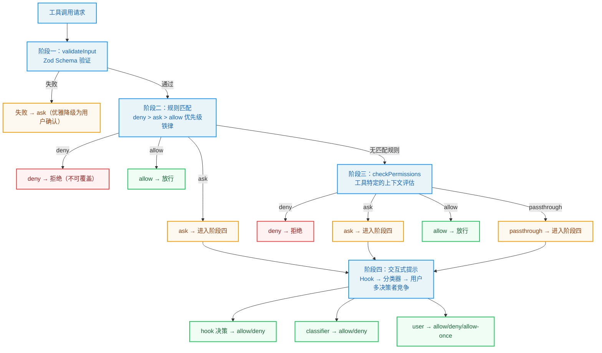
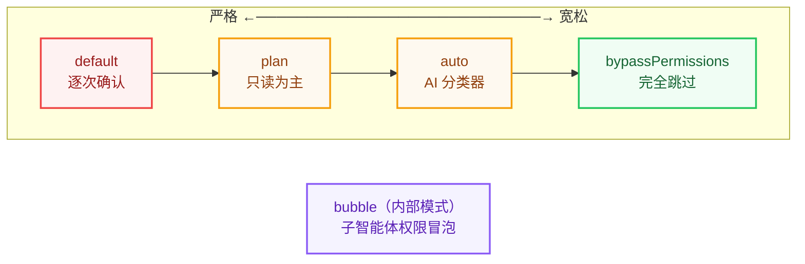

# 权限管理系统设计文档

> 基于 Claude Code 四阶段权限检查流程实现

## 概述

权限管线（Permission Pipeline）是 Agent 的安全护栏。它不是简单的"允许/拒绝"开关，而是一套精心设计的多阶段检查机制，在自动化效率与安全控制之间寻找精确的平衡。

**核心设计思想**：纵深防御（Defense in Depth）

如同现代化办公大楼的门禁系统不是只在入口设一个保安，而是在不同区域设置了不同级别的安全检查——大堂只需刷卡，会议室需要预约确认，服务器机房需要指纹验证加双人授权。每一层安全检查都是独立的，即使某一层被绕过，下一层仍然可以阻止未授权的访问。

## 架构设计

### 四阶段权限检查流程



### 阶段一：Input Validation（输入验证）

**职责**：验证输入数据的合法性，而非权限。

**设计原则**：在安全系统中，错误处理应该是"安全的"而非"正确的"。

```rust
fn validate_input_permissions(
    &self,
    input: &Self::Input,
    context: &ToolContext,
) -> InputValidationResult
```

**关键行为**：
- 使用 Zod Schema 验证输入结构
- 解析失败时返回 `passthrough`，随后转换为 `ask`
- 优雅降级为用户确认，而非直接崩溃

**示例**：
```rust
// BashTool 的输入验证
fn validate_input_permissions(&self, input: &BashInput) -> InputValidationResult {
    if input.command.trim().is_empty() {
        return InputValidationResult::invalid("Command cannot be empty");
    }
    InputValidationResult::valid()
}
```

### 阶段二：Rule Matching（规则匹配）

**职责**：按照严格的优先级顺序检查三类规则：deny > ask > allow

**优先级铁律**：deny 始终优先于 allow，无论它们的来源如何。

#### 七种规则来源（优先级从高到低）

```
1. session          - 会话级（最高优先级）
2. command          - 命令级
3. cliArg           - 命令行参数
4. policySettings   - 策略设置
5. flagSettings     - 功能标志
6. localSettings    - 本地设置（不提交 Git）
7. projectSettings  - 项目设置
8. userSettings     - 全局用户设置（最低优先级）
```

#### 规则匹配逻辑

```rust
pub fn matches(&self, tool_name: &str, command: Option<&str>) -> bool {
    // 解析规则目标
    let (rule_tool, rule_content) = Self::parse_rule_target(&self.target);
    
    // 支持三种匹配模式：
    // 1. 精确匹配："Bash" 或 "Bash(npm test)"
    // 2. 前缀匹配："Bash(npm:*)" - 所有 npm 开头的命令
    // 3. 通配符匹配："Bash(git *)" - git 后跟任意参数
}
```

#### Bash 工具的精细控制

```json
{
  "permissions": {
    "allow": [
      "Bash(npm test)",      // 精确匹配：仅允许 npm test
      "Bash(npm:*)",         // 前缀匹配：所有 npm 开头的命令
      "Bash(git *)"          // 通配符：git 后跟任意参数
    ],
    "deny": [
      "Bash(npm publish)",   // 精确拒绝发布
      "Bash(* > /etc/*)"     // 通配符：拦截写入/etc 的命令
    ]
  }
}
```

### 阶段三：Context Check（上下文评估）

**职责**：工具特定的权限评估，理解命令语义。

```rust
async fn check_permissions(
    &self,
    input: &Self::Input,
    context: &ToolContext,
) -> PermissionResult
```

#### Bash 命令语义分析

| 类别 | 命令 | 权限行为 |
|------|------|----------|
| 搜索命令 | grep, find, rg, ag, locate, which | 只读，自动放行 |
| 读取命令 | cat, head, tail, less, wc, stat, jq | 只读，自动放行 |
| 列表命令 | ls, tree, du, df | 只读，自动放行 |
| 静默命令 | cp, mv, mkdir, rm, chmod | 需要确认 |
| 危险命令 | rm -rf /, mkfs, dd, fork bomb | 绝对拒绝 |

#### 安全检查实现

```rust
async fn check_permissions(&self, input: &BashInput) -> PermissionResult {
    let analysis = BashSemanticAnalyzer::analyze_command(&input.command);
    
    // 检查危险命令
    if analysis.is_dangerous {
        return PermissionResult::deny(analysis.danger_reason);
    }
    
    // 检查敏感路径
    if analysis.accesses_sensitive_path {
        return PermissionResult::ask("Accesses sensitive paths");
    }
    
    // 检查破坏性操作
    if analysis.is_destructive {
        return PermissionResult::ask("Destructive operation");
    }
    
    PermissionResult::allow()
}
```

### 阶段四：Interactive Prompt（交互式提示）

**职责**：多决策者竞争解决（Hook → Classifier → User）

**决策来源信任等级**：
- **Hook**（最高）：外部 Hook 脚本，代表系统管理员意图
- **User**（中等）：用户手动选择，代表当前操作者意图
- **Classifier**（最低）：AI 自动判断，可能出错

#### ResolveOnce 模式：原子化竞争解决

```rust
pub struct ResolveOnce<T> {
    claimed: AtomicBool,
    value: Mutex<Option<T>>,
}

impl<T> ResolveOnce<T> {
    pub fn claim(&self) -> bool {
        !self.claimed.swap(true, Ordering::SeqCst)
    }
}
```

**设计洞察**：如同"单程机票"——一旦被某人兑换（claim），其他人就无法再使用同一张机票。不需要锁、不需要等待、不需要协调。

## 权限模式谱系

从严格到宽松的五种模式：



### Default 模式：逐次确认

- **行为**：除了被明确 allow 规则放行的工具外，每次工具调用都需要用户确认
- **适用场景**：日常交互式使用
- **权衡**：最安全但最繁琐

### Plan 模式：只读为主

- **行为**：写入类工具（Edit、Write）被 deny，只读工具（Read、Grep、Glob）正常放行
- **适用场景**：代码审查和架构分析
- **设计哲学**：先理解后行动的工作流

### Auto 模式：自动审批

- **行为**：使用 AI 分类器（YOLO classifier）代替人工审批
- **优化**：
  1. acceptEdits 快速路径：已知安全的操作跳过分类器
  2. 安全工具白名单：Read、Grep、Glob、TodoWrite 等跳过检查
  3. 拒绝追踪：连续拒绝多次后回退到交互式提示
- **适用场景**：熟悉的工作流，信任分类器判断
- **反模式**：不适用于生产环境部署、敏感数据操作、不可逆操作

### BypassPermissions 模式：完全跳过

- **行为**：除了 deny 规则和 safetyCheck 外，全部自动放行
- **适用场景**：CI/CD 管道、自动化测试、受控执行环境
- **企业级安全最佳实践**：
  1. 在容器或虚拟机中运行，确保文件系统隔离
  2. 配置显式的 deny 规则阻止危险操作
  3. 使用 `--allowedTools` 参数限制可用工具范围
  4. 启用审计日志记录所有工具调用

### Bubble 模式：子智能体权限冒泡（内部模式）

- **行为**：子智能体的权限检查冒泡回主智能体
- **适用场景**：AgentTool 创建子智能体时
- **设计原则**：子智能体不会获得超出主智能体的权限

## PermissionContext 设计

### 不可变数据模式

```rust
#[derive(Debug, Clone, Default)]
pub struct ToolPermissionContext {
    pub mode: PermissionMode,
    pub extra_work_dirs: Vec<String>,
    pub allow_rules: HashMap<RuleSource, Vec<PermissionRule>>,
    pub deny_rules: HashMap<RuleSource, Vec<PermissionRule>>,
    pub ask_rules: HashMap<RuleSource, Vec<PermissionRule>>,
    pub bypass_available: bool,
    pub avoid_permission_prompts: bool,
    pub safe_tools: Vec<String>,
    pub accept_edits_mode: bool,
}
```

**所有字段均为 readonly**：每次权限更新产生新的上下文对象，确保并发安全。

### 并发安全性场景

假设工具 A 和工具 B 同时开始权限检查。在检查过程中，工具 A 的用户确认触发了一次权限规则更新（用户选择"始终允许"）。

- **如果 PermissionContext 是可变的**：工具 B 可能在检查过程中看到规则被修改，导致同一个请求的前后检查不一致。
- **不可变性确保了**：每个权限检查使用的都是确定性的快照。

## 权限更新与持久化

### 六种更新操作 × 五种配置源 = 30 种可能的更新

```rust
pub enum PermissionUpdate {
    AddRules { source: RuleSource, rules: Vec<PermissionRule> },
    ReplaceRules { source: RuleSource, rules: Vec<PermissionRule> },
    RemoveRules { source: RuleSource, targets: Vec<String> },
    SetMode { mode: PermissionMode, set_bypass_available: bool },
    AddWorkDir { dir: String },
    RemoveWorkDir { dir: String },
}
```

### 双层更新机制

```rust
// 内存应用：同步即时
let result = apply_permission_updates(&context, &updates);

// 文件持久化：异步（仅 local/user/project 支持）
if result.has_persistable_update {
    persist_to_filesystem(&result.new_context);
}
```

**设计哲学**：内存优先、持久化异步。先确保内存状态正确（影响当前行为），然后异步写入持久存储（影响未来行为）。如果持久化失败，当前会话的行为不受影响，但重启后规则会丢失。

## 企业级安全配置模板

### 项目级 settings.json（团队共享）

```json
{
  "permissions": {
    "allow": [
      "Bash(npm test)",
      "Bash(npm run lint)",
      "Bash(git:*)",
      "Read",
      "Glob",
      "Grep"
    ],
    "deny": [
      "Bash(npm publish)",
      "Bash(rm -rf *)",
      "Bash(* > /etc/*)"
    ]
  }
}
```

### 个人 settings.local.json（不提交到 Git）

```json
{
  "permissions": {
    "allow": [
      "Bash(npx eslint *)",
      "Bash(cargo check)",
      "Bash(cargo clippy)"
    ]
  }
}
```

## 关键要点总结

1. **四阶段管线**：validateInput → 规则匹配 → checkPermissions → 交互式提示，纵深防御
2. **优先级铁律**：deny 始终优先于 allow，无论来源如何
3. **PermissionContext 不可变性**：确保并发安全性
4. **ResolveOnce 原子竞争**：轻量级互斥，避免复杂锁管理
5. **五模式谱系**：从 default 到 bypassPermissions，覆盖交互开发到自动化
6. **Bash 工具精细控制**：精确匹配、前缀匹配、通配符匹配三种规则格式
7. **双层更新机制**：内存应用即时生效，文件持久化异步
8. **企业级安全**：项目级 local 和用户级 personal 组合配置

## 参考资料

- 《御舆：解码 Agent Harness》第四章：权限管线 -- Agent 的护栏
- https://lintsinghua.github.io/
- https://github.com/lintsinghua/claude-code-book
