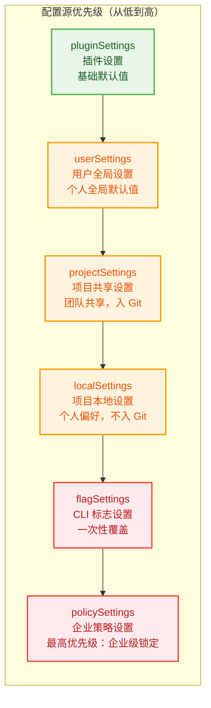
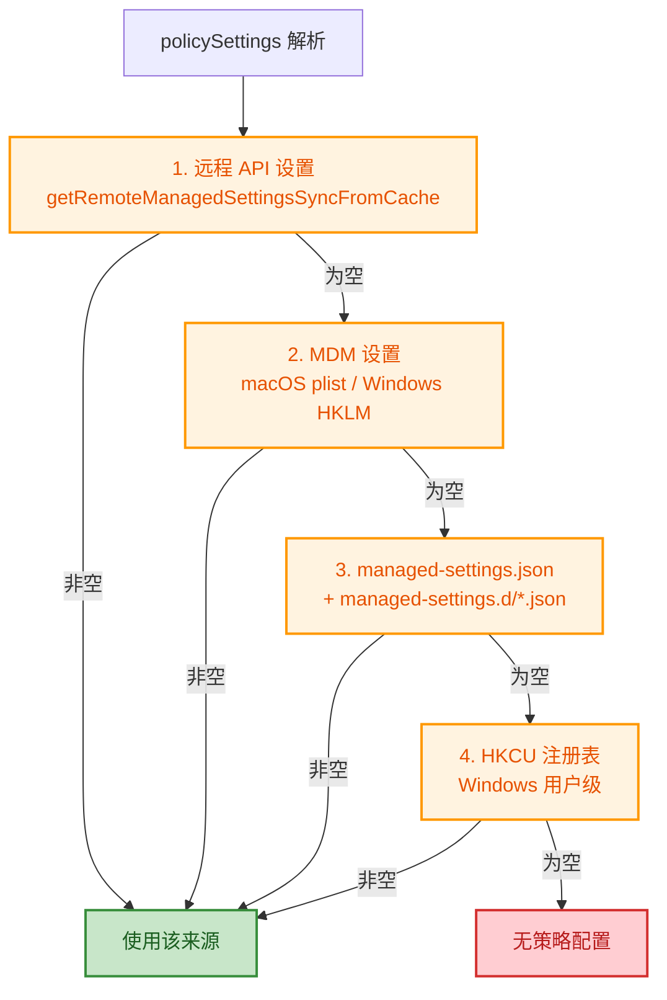
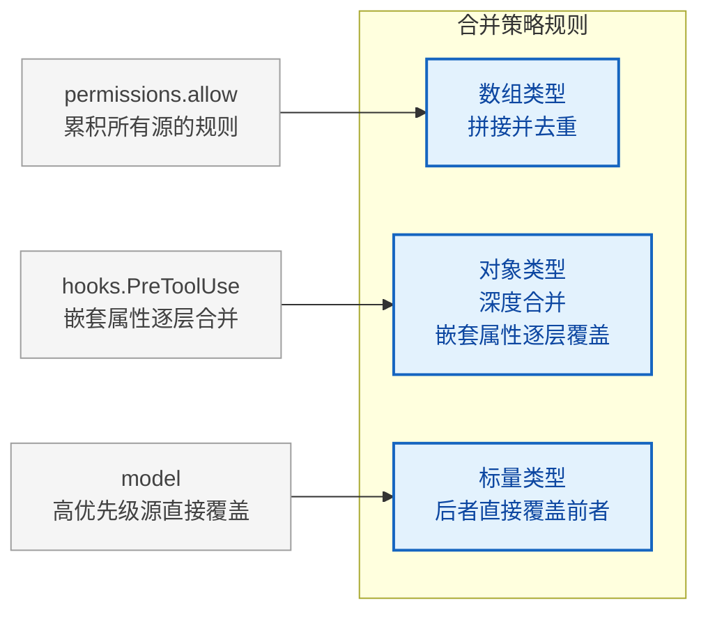
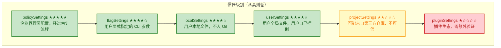
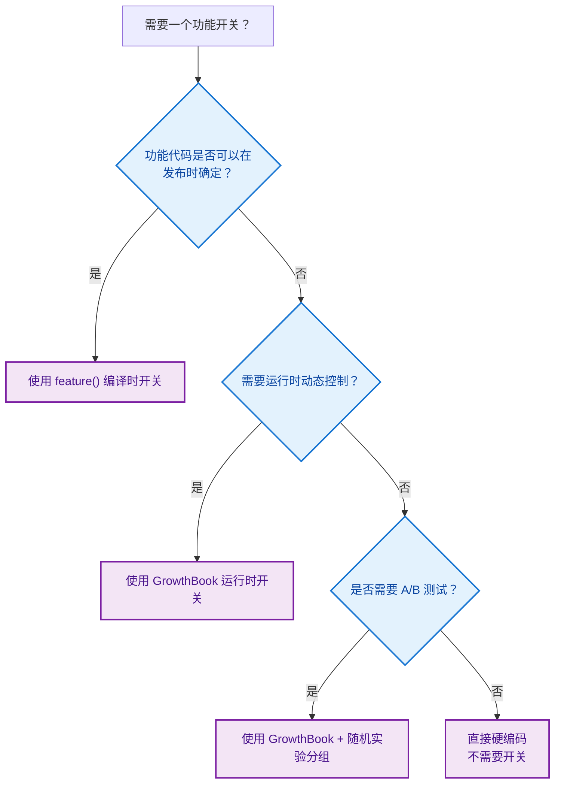

# 设置与配置系统设计文档

> Agent 的基因：六层配置源体系与状态管理

## 概述

Claude Code 的行为不是由某个单一配置文件决定的，而是由**六层配置源**逐层合并而成。这些配置源就像 Agent 的"基因"——它们在 Agent 启动前就已写定，决定了 Agent 能做什么、不能做什么、以及以何种方式去做。

**核心设计思想**：分层信任与纵深防御

将配置系统比作"基因"是恰当的：正如生物体的基因在受精卵形成时就已确定，并在发育过程中逐层表达，Claude Code 的配置也在启动时加载，在运行时逐层生效。不同的是，Agent 的"基因"可以被精准地编辑和覆盖——这既是强大的能力，也带来了安全挑战。

## 六层配置源优先级体系

### 配置源定义与顺序

完整的优先级链从低到高是：

```
pluginSettings → userSettings → projectSettings → localSettings → flagSettings → policySettings
```



> 每一层都可以覆盖下层的配置，但不会删除下层配置——它们只是被"遮盖"了。这种设计确保了每一层都可以独立理解和维护。

### 各配置源详情

| 配置源 | 文件路径 | 说明 | 是否入 Git | 可信度 |
|--------|----------|------|-----------|--------|
| pluginSettings | 插件提供 | 基础默认值 | N/A | ★☆☆☆☆ |
| userSettings | `~/.claude/settings.json` | 全局用户设置 | N/A | ★★★★☆ |
| projectSettings | `<project>/.claude/settings.json` | 项目共享设置 | 是 | ★★☆☆☆ |
| localSettings | `<project>/.claude/settings.local.json` | 项目本地设置 | 否 | ★★★★☆ |
| flagSettings | CLI `--settings` 参数 | 一次性覆盖 | N/A | ★★★★☆ |
| policySettings | managed-settings.json | 企业管理 | N/A | ★★★★★ |

### 策略层的特殊解析逻辑

`policySettings` 遵循 **"first source wins"**（第一个非空源胜出）策略，而非深度合并：



注意 policySettings 使用的是"首个非空源胜出"而非"深度合并"。这个差异至关重要：企业管理策略通常是一个完整的、经过审计的配置方案，不同来源的策略之间不应该互相"渗透"。

## 合并规则



### 核心合并算法

```rust
pub fn settingsMergeCustomizer(objValue: Value, srcValue: Value) -> Value {
    match (objValue, srcValue) {
        // 数组：拼接并去重
        (Array(mut target), Array(source)) => {
            target.extend(source);
            // 去重...
            Array(target)
        }
        // 对象：深度合并
        (Object(mut target), Object(source)) => {
            for (key, src_val) in source {
                let target_val = target.remove(&key);
                let merged = match target_val {
                    Some(t) => merge(t, src_val),
                    None => src_val,
                };
                target.insert(key, merged);
            }
            Object(target)
        }
        // 标量：后者覆盖前者
        (_, src) => src,
    }
}
```

### 完整合并示例

```
场景：一个前端团队的项目配置

// ~/.claude/settings.json (userSettings - 开发者小张的个人全局设置)
{
  "model": "claude-sonnet-4",
  "permissions": {
    "allow": ["Bash(npm *)", "Bash(node *)"]
  },
  "verbose": true
}

// .claude/settings.json (projectSettings - 团队共享设置，提交到 Git)
{
  "permissions": {
    "allow": ["Bash(npm run lint)", "Bash(npm test)", "Read(*)"]
  },
  "hooks": {
    "PreToolUse": [{ "matcher": "Bash(*)", "hooks": [{ "type": "command", "command": "audit-log.sh" }] }]
  }
}

// .claude/settings.local.json (localSettings - 小张的本地覆盖)
{
  "model": "claude-opus-4",
  "permissions": {
    "allow": ["Bash(git *)"]
  }
}

合并结果：
{
  "model": "claude-opus-4",          // localSettings 覆盖 userSettings
  "verbose": true,                    // 仅 userSettings 设置，保持不变
  "permissions": {
    "allow": [
      "Bash(npm *)",                  // 来自 userSettings
      "Bash(node *)",                 // 来自 userSettings
      "Bash(npm run lint)",           // 来自 projectSettings
      "Bash(npm test)",              // 来自 projectSettings
      "Read(*)",                      // 来自 projectSettings
      "Bash(git *)"                   // 来自 localSettings
    ]                                  // 数组拼接去重
  },
  "hooks": {
    "PreToolUse": [{ ... }]           // 仅 projectSettings 设置
  }
}
```

**为什么数组采用拼接而非替换？**

这是一个经过深思熟虑的设计决策。在权限系统中，每一条规则都是一道"防线"——如果高优先级源的数组替换了低优先级源的数组，就意味着高优先级源必须完整枚举所有需要的权限规则，任何遗漏都会变成安全漏洞。拼接策略让每层只需要关心自己要"增加"的规则，系统会自动合并所有层的安全策略。

**反模式警告**：不要利用数组拼接来"撤销"下层的规则。例如，你不能通过在上层设置一个空数组来清除下层的权限——空数组拼接后下层规则依然存在。如果需要撤销，应该使用 `permissions.deny` 字段来显式拒绝。

## 安全边界设计

配置系统的核心安全挑战是：`projectSettings`（`.claude/settings.json`）会被提交到 Git 仓库，这意味着克隆恶意仓库的用户可能在不知情的情况下加载攻击者的配置。Claude Code 的防护策略是：**在安全敏感的检查中，系统性地排除 `projectSettings`**。

### 供应链攻击的威胁模型

| 维度 | 传统软件供应链 | Agent 配置供应链 |
|------|--------------|-----------------|
| 攻击向量 | 恶意依赖包、篡改的构建产物 | 恶意配置文件、hooks 注入 |
| 受害者 | 运行软件的系统 | 使用 Agent 的开发者 |
| 攻击面 | 构建管道、运行时环境 | 文件系统、代码执行、数据访问 |
| 隐蔽性 | 中等（需要绕过安全检测） | 极高（配置文件看似正常） |
| 影响范围 | 软件用户 | 开发者的整个工作环境 |

### projectSettings 的系统性排除

以下函数展示了相同的模式：检查安全相关的设置时，**只从 userSettings、localSettings、flagSettings 和 policySettings 中读取，有意排除 projectSettings**。

```rust
/// 返回 true 表示任何可信的设置来源都接受了 bypass 权限模式对话框
/// projectSettings 被有意排除 —— 恶意仓库可能自动绕过对话框（RCE 风险）
pub fn has_skip_dangerous_mode_permission_prompt() -> bool {
    get_from_trusted_sources(&sources, "skipDangerousModePermissionPrompt")
        .and_then(|v| v.as_bool())
        .unwrap_or(false)
}

/// 返回 true 表示任何可信的设置来源已接受 auto 模式 opt-in 对话框
/// projectSettings 被有意排除 —— 恶意仓库可能自动绕过对话框（RCE 风险）
pub fn has_auto_mode_opt_in() -> bool {
    get_from_trusted_sources(&sources, "skipAutoPermissionPrompt")
        .and_then(|v| v.as_bool())
        .unwrap_or(false)
}
```

注释一致指向同一个原因：**projectSettings is intentionally excluded -- a malicious project could otherwise auto-bypass the dialog (RCE risk)**。

### 信任半径递减原则



> 在安全敏感的检查中，系统只读取信任级别 >= 3 星的配置源。这个原则贯穿了整个配置系统的安全设计。

### shouldAllowManagedHooksOnly

当策略设置中启用了 `allowManagedHooksOnly` 时，hooks 的执行只使用来自 `policySettings` 的 hooks，所有来自 user/project/local 的 hooks 被跳过。这是一个企业安全特性：管理员可以确保只有经过审核的 hooks 在组织内运行。

### pluginOnlyPolicy

`strictPluginOnlyCustomization` 策略定义了四种可锁定的"定制面"（customization surfaces）：skills、agents、hooks、mcp。

被锁定的面中，只有以下来源被信任：
- **plugin** -- 通过 `strictKnownMarketplaces` 单独管控
- **policySettings** -- 由管理员设置，天然可信
- **built-in / bundled** -- 随 CLI 发布，非用户编写

而用户级别和项目级别的定制全部被阻断。

## 功能开关系统

Claude Code 的功能开关系统分为两层：**编译时**的 `feature()` 函数和**运行时**的 GrowthBook 实验框架。

### 编译时死代码消除

`feature()` 函数通过 bundler 引入。当 `feature('FEATURE_NAME')` 返回 `false` 时，bundler 会将对应的代码分支完全移除。

**为什么选择编译时消除而非运行时条件判断？**

| 维度 | 运行时判断 | 编译时消除 |
|------|-----------|-----------|
| 包体积 | 未启用代码仍占用 | 完全移除 |
| 性能开销 | 有运行时分支 | 零开销 |
| 安全性 | 未启用代码可能有漏洞 | 完全不存在 |

主要的功能标志包括：

| 功能标志 | 作用域 | 说明 |
|----------|--------|------|
| `KAIROS` | 核心架构 | Assistant 模式（长驻会话） |
| `EXTRACT_MEMORIES` | 记忆系统 | 后台记忆提取 |
| `TRANSCRIPT_CLASSIFIER` | 权限系统 | 自动模式分类器 |
| `TEAMMEM` | 协作系统 | 团队记忆 |
| `CHICAGO_MCP` | 工具系统 | Computer Use MCP |
| `TEMPLATES` | 任务系统 | 模板与工作流 |
| `BUDDY` | UI 系统 | 伴侣精灵 |
| `DAEMON` | 架构 | 后台守护进程 |
| `BRIDGE_MODE` | 架构 | 桥接模式 |

### GrowthBook 实验框架

对于需要在运行时动态控制的功能，Claude Code 使用 GrowthBook A/B 测试框架。主要的入口函数 `getFeatureValue_CACHED_MAY_BE_STALE` 接受特性名称和默认值，从缓存中同步读取实验配置。

函数名中的 "CACHED_MAY_BE_STALE" 直白地说明了其语义：值来自缓存，可能在跨进程的场景下已过时。这是为了在启动关键路径上避免异步等待——同步读取缓存比阻塞等待远程配置更可取。

**这种命名方式值得所有系统设计者学习。** 在 API 设计中，将非显而易见的行为约束直接编码到函数名中，可以让调用者在每次使用时都被"提醒"这个约束。

**编译时 vs 运行时开关的决策树：**



## 状态管理系统

状态管理是 Agent 系统的"神经系统"——配置是基因，决定了 Agent 的潜力；状态是神经系统，实时传递和协调 Agent 的运行时行为。

### Store：极简不可变状态容器

```rust
/// 状态存储器（34 行实现）
pub struct Store<T> {
    state: Arc<RwLock<T>>,
    on_change: Option<OnChange<T>>,
    listeners: Arc<RwLock<Vec<Listener>>>,
}

impl<T> Store<T> {
    /// 获取当前状态
    pub fn get_state(&self) -> T { }
    
    /// 更新状态（通过 updater 函数）
    pub fn set_state(&self, updater: impl FnOnce(&T) -> T) -> bool { }
    
    /// 订阅状态变化
    pub fn subscribe(&self, listener: impl Fn()) -> CancelFn { }
}
```

三个关键设计决策：

1. **不可变更新**：`set_state` 接受一个 updater 函数 `(prev: T) -> T`，要求调用者返回全新的状态对象。通过 `PartialEq` 比较新旧值——只有值发生变化时才通知监听者。

2. **泛型 `on_change` 回调**：在 Store 创建时传入，每次状态变更都会携带新旧状态被调用。

3. **Set-based 监听者管理**：使用 `Vec` 存储监听者，`subscribe` 返回取消函数，遵循 RAII cleanup 模式。

### 为什么只有 34 行？

一个 Agent CLI 工具的状态管理需求与一个复杂的 Web 应用有本质区别：

| 维度 | Web 应用 | Agent CLI |
|------|---------|-----------|
| 状态变更频率 | 极高（毫秒级 UI 交互） | 中等（秒级工具调用） |
| 并发更新 | 常见（多用户同时操作） | 少见（单用户单会话） |
| 时间旅行调试 | 有价值 | 不必要 |
| 中间件需求 | 高 | 低 |

34 行的 Store 意味着：没有 reducer 样板代码、没有 action 类型定义、没有中间件配置——只有最核心的 get/set/subscribe。

### AppState：全局状态的类型定义

```rust
/// 全局状态（DeepImmutable 标记）
pub struct AppState {
    // 设置层
    pub settings: SettingsJson,
    pub verbose: bool,
    pub main_loop_model: String,
    
    // UI 层
    pub expanded_view: Option<String>,
    pub status_line_text: String,
    
    // 工具权限层
    pub tool_permission_context: ToolPermissionContext,
    
    // MCP 层
    pub mcp_clients: HashMap<String, McpClient>,
    pub mcp_tools: Vec<McpTool>,
    
    // 插件层
    pub plugins_enabled: Vec<String>,
    pub plugins_disabled: Vec<String>,
    
    // Agent 层
    pub agent_definitions: HashMap<String, AgentDefinition>,
}
```

`DeepImmutable<T>` 类型标记意味着编译器会在编译时阻止任何直接修改状态字段的尝试。这是一种"让正确的事情容易，让错误的事情不可能"的设计哲学在类型系统层面的体现。

## 实战配置模式

### 模式一：个人 - 团队分离

```
~/.claude/settings.json      → 个人模型偏好、个人常用的权限规则
.claude/settings.json         → 团队统一的 lint 规则、权限基线、共享 hooks
.claude/settings.local.json   → 个人覆盖（调试模式、特殊权限）
```

### 模式二：CI/CD 专用配置

```bash
claude --settings /path/to/ci-settings.json
```

### 模式三：企业统一管控

```jsonc
// managed-settings.json (policySettings)
{
  "model": "claude-enterprise",
  "permissions": {
    "deny": ["Bash(sudo *)", "Bash(npm publish)"],
    "disableBypassPermissionsMode": "disable"
  },
  "allowManagedHooksOnly": true,
  "strictPluginOnlyCustomization": ["mcp", "hooks"]
}
```

## 关键要点

1. **六层优先级链**：pluginSettings → userSettings → projectSettings → localSettings → flagSettings → policySettings，后者覆盖前者
2. **合并策略**：数组拼接去重，对象深度合并，标量直接覆盖
3. **安全边界**：`projectSettings` 在所有安全敏感检查中被排除
4. **策略层的特殊合并**：policySettings 使用"首个非空源胜出"而非深度合并
5. **双重功能开关**：`feature()` 提供编译时死代码消除，GrowthBook 提供运行时实验控制
6. **不可变状态**：Store 使用 PartialEq 比较，强制不可变更新模式

## 参考资料

- 《御舆：解码 Agent Harness》第五章：设置与配置
- https://lintsinghua.github.io/
- Claude Code 源码：`src/utils/settings/settings.ts`
