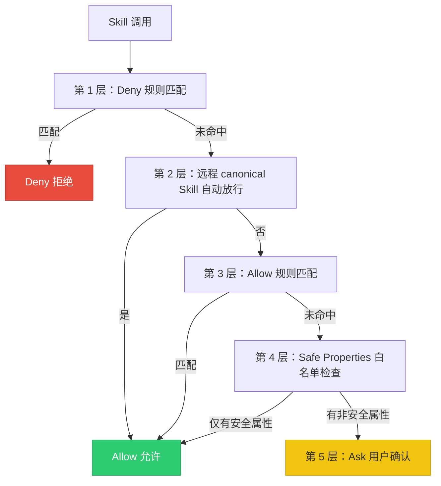

# 第 11 章 技能系统与插件架构 - 技术设计方案

**需求名称**: chapter11-skill-plugin-architecture  
**更新日期**: 2026-04-17  
**版本**: 1.0

---

## 1. 概述

### 1.1 需求背景

基于 Claude Code 的技能系统与插件架构进行对齐实现，构建一个多层次、可扩展的技能系统。技能 (Skill) 是将**Prompt + 权限配置**封装为可复用的 Markdown 文件，插件 (Plugin) 是更高层级的扩展单元，可包含技能、agents、hooks 等多种组件。

### 1.2 设计目标

1. **零配置可用，有配置强大**：内置技能开箱即用，自定义技能灵活强大
2. **多层次技能来源**：支持管理策略级、用户级、项目级、插件级、内置级五层来源
3. **安全优先**：根据技能来源信任等级实施差异化安全策略
4. **惰性加载与缓存优先**：优化启动性能和内存使用
5. **与 Claude Code 对齐**：参考 Claude Code 的实现模式，保持架构一致性

### 1.3 范围

本设计涵盖以下内容：
- 技能系统架构与加载引擎
- 技能定义格式与 Frontmatter 配置
- 技能执行引擎（Inline/Fork 模式）
- 权限模型与安全边界
- 插件系统目录结构与加载策略
- 与 Claude Code 的对齐方案

---

## 2. 架构设计

### 2.1 整体架构图

```mermaid
graph TD
    subgraph 技能来源层
        M[管理策略级 Managed<br/>$MANAGED_DIR/.claude/skills/]
        U[用户级 User<br/>~/.claude/skills/]
        P[项目级 Project<br/>.claude/skills/]
        PL[插件级 Plugin<br/>{plugin-dir}/commands/]
        B[内置级 Bundled<br/>编译嵌入]
    end
    
    subgraph 加载引擎层
        LE[SkillLoader<br/>加载引擎]
        DE[动态发现引擎<br/>discover_skills_for_path]
        CS[条件技能激活<br/>conditional_skills]
    end
    
    subgraph 执行引擎层
        SE[SkillExecutor]
        IM[Inline 模式<br/>主对话流注入]
        FM[Fork 模式<br/>独立子 Agent]
    end
    
    subgraph 权限层
        PC[SkillPermissionChecker<br/>五层权限检查]
        SP[Safe Properties<br/>白名单]
        ED[Shell 命令展开器]
    end
    
    M --> LE
    U --> LE
    P --> LE
    PL --> LE
    B --> LE
    
    LE --> DE
    DE --> CS
    CS --> SE
    
    SE --> IM
    SE --> FM
    
    SE --> PC
    PC --> SP
    PC --> ED
    
    style M fill:#e74c3c,stroke:#c0392b,color:#fff
    style U fill:#3498db,stroke:#2471a3,color:#fff
    style P fill:#f39c12,stroke:#d68910,color:#fff
    style PL fill:#9b59b6,stroke:#7d3c98,color:#fff
    style B fill:#bdc3c7,stroke:#7f8c8d,color:#333
    style LE fill:#2ecc71,stroke:#27ae60,color:#fff
    style SE fill:#1abc9c,stroke:#16a085,color:#fff
    style PC fill:#f1c40f,stroke:#d4ac0d,color:#333
```

### 2.2 模块分层

| 层级 | 模块 | 职责 |
|------|------|------|
| **来源层** | `skills/loader.rs` | 从五层来源加载技能 |
| **类型层** | `skills/types.rs` | 类型定义与 Frontmatter 解析 |
| **执行层** | `skills/executor.rs` | Inline/Fork 双模式执行 |
| **权限层** | `skills/permissions.rs` | 五层权限检查与安全属性白名单 |
| **插件层** | `plugins/` | 插件管理与扩展 |

### 2.3 与 Claude Code 的文件映射

| Claude Code 文件 | 本实现 | 状态 |
|-----------------|--------|------|
| `src/skills/loadSkillsDir.ts` | `crates/agent/src/skills/loader.rs` | ✅ 已实现 |
| `src/tools/SkillTool/SkillTool.ts` | `crates/agent/src/skills/executor.rs` | ✅ 已实现 |
| `src/skills/types.ts` | `crates/agent/src/skills/types.rs` | ✅ 已实现 |
| `src/skills/permissions.ts` | `crates/agent/src/skills/permissions.rs` | ✅ 已实现 |
| `src/utils/plugins/pluginLoader.ts` | `crates/plugins/src/lib.rs` | ✅ 框架已实现 |

---

## 3. 组件设计

### 3.1 技能加载引擎 (SkillLoader)

#### 3.1.1 五层加载路径

```rust
pub fn load_all_from_disk(&mut self) -> Result<usize, String> {
    // 1. 管理策略目录 (最高优先级)
    //    $MANAGED_DIR/.claude/skills/
    //    可通过 CLAUDE_CODE_DISABLE_POLICY_SKILLS 禁用
    
    // 2. 用户全局目录
    //    ~/.claude/skills/
    
    // 3. 项目级目录 (向上遍历至 home)
    //    .claude/skills/
    //    支持嵌套目录发现
    
    // 4. 附加目录 (--add-dir 指定)
    //    {add-dir}/.claude/skills/
    
    // 5. 旧版命令目录 (兼容)
    //    .claude/commands/
}
```

#### 3.1.2 去重策略

```rust
// 使用 realpath 解析符号链接获得规范路径
let canonical_dir = dir.canonicalize()
    .unwrap_or_else(|_| dir.to_path_buf());

// 去重检查 - 避免通过符号链接或重叠父目录导致的重复加载
if self.seen_dirs.contains(&canonical_dir) {
    return Ok(0);
}
self.seen_dirs.insert(canonical_dir.clone());
```

#### 3.1.3 动态技能发现

```rust
/// 基于文件路径的动态发现
/// 从被操作的文件路径开始，向上遍历至 CWD
pub fn discover_skills_for_path(file_path: &Path) -> Vec<PathBuf> {
    let mut skill_dirs = Vec::new();
    let mut current = file_path.parent().unwrap_or(file_path).to_path_buf();
    let cwd = std::env::current_dir().unwrap_or_default();
    
    // 向上遍历 (不包含 CWD 本身)
    while current != cwd && current.pop() {
        let skills_dir = current.join(".claude/skills");
        if skills_dir.exists() {
            // 使用 realpath 去重
            if let Ok(canonical) = skills_dir.canonicalize() {
                skill_dirs.push(canonical);
            }
        }
    }
    
    // 按路径深度排序 (深层优先)
    skill_dirs.sort_by(|a, b| {
        b.components().count().cmp(&a.components().count())
    });
    
    skill_dirs
}
```

### 3.2 技能类型系统

#### 3.2.1 SkillCommand 结构

```rust
pub struct SkillCommand {
    pub name: String,                      // Skill 名称
    pub description: String,               // 描述
    pub when_to_use: Option<String>,       // 使用时机
    pub allowed_tools: Vec<String>,        // 工具白名单
    pub argument_hint: Option<String>,     // 参数提示
    pub arguments: Vec<String>,            // 声明式参数名
    pub model: Option<ModelOverride>,      // 模型覆盖
    pub effort: Option<EffortLevel>,       // 努力级别
    pub context: ExecutionContext,         // 执行模式
    pub agent: Option<String>,             // 指定 Agent
    pub user_invocable: bool,              // 用户可调用
    pub disable_model_invocation: bool,    // 禁用 AI 调用
    pub version: Option<String>,           // 版本号
    pub paths: Vec<String>,                // 条件激活路径
    pub hooks: HashMap<String, Vec<HookConfig>>, // Hook 配置
    pub shell: Vec<String>,                // Shell 环境
    pub source: SkillSource,               // 来源
    pub loaded_from: SkillLoadSource,      // 加载位置
    pub content: String,                   // 内容 (Markdown)
    pub skill_dir: String,                 // 技能目录
}
```

#### 3.2.2 LoadedFrom 类型与安全策略映射

```rust
pub enum SkillLoadSource {
    Managed,      // 管理策略级 - 信任等级：高
    UserSettings, // 用户级 - 信任等级：中
    ProjectSettings, // 项目级 - 信任等级：中
    AddDir,       // 附加目录 - 信任等级：中
    MCP,          // MCP 服务器 - 信任等级：低 (禁止 Shell 内联)
}
```

**安全边界**：
- `loaded_from == SkillLoadSource::MCP` 时，**禁止执行内联 Shell 命令**
- MCP 技能来自不可信的远端服务器，这是一个关键的信任边界

### 3.3 执行引擎 (SkillExecutor)

#### 3.3.1 双模式执行架构

```rust
pub async fn execute(
    &self,
    skill: &SkillCommand,
    arguments: Option<&str>,
) -> Result<SkillExecutionResult, SkillExecutionError> {
    match skill.context {
        ExecutionContext::Inline => self.execute_inline(skill, arguments).await,
        ExecutionContext::Fork => self.execute_fork(skill, arguments).await,
    }
}
```

#### 3.3.2 Inline 模式执行流程

```mermaid
flowchart TD
    A[Skill 被调用] --> B[1. 参数替换 $ARGUMENTS]
    B --> C[2. 环境变量替换<br/>${CLAUDE_SKILL_DIR}<br/>${CLAUDE_SESSION_ID}]
    C --> D{MCP 技能？}
    D -->|Yes| E[跳过 Shell 命令展开]
    D -->|No| F[3. 展开 Shell 命令 !`]
    E --> G[4. 构建上下文修饰器]
    F --> G
    G --> H[返回 new_messages + context_modifier]
    
    style A fill:#3498db,stroke:#2471a3,color:#fff
    style H fill:#2ecc71,stroke:#27ae60,color:#fff
```

**ContextModifier 作用**：
```rust
pub struct ContextModifier {
    pub allowed_tools: Vec<String>,    // 工具白名单注入
    pub model: Option<ModelOverride>,  // 模型切换
    pub effort: Option<EffortLevel>,   // 努力级别覆盖
}
```

#### 3.3.3 Fork 模式执行流程

```rust
async fn execute_fork(
    &self,
    skill: &SkillCommand,
    arguments: Option<&str>,
) -> Result<SkillExecutionResult, SkillExecutionError> {
    // 1. 准备 Fork 上下文
    let content = self.process_arguments(&skill.content, arguments);
    let content = self.replace_env_variables(&content, &skill.skill_dir);
    
    // 2. 构建子代理参数
    let params = SubagentParams {
        prompt_messages: vec![Message::user(content)],
        subagent_type: SubagentType::Custom(
            skill.agent.clone().unwrap_or_else(|| "worker".to_string())
        ),
        directive: skill.description.clone(),
        max_turns: None,
        // ...
    };
    
    // 3. 执行子代理 (待与 subagent executor 集成)
    // 4. 提取结果文本
    // 5. 释放子 Agent 消息
    Ok(SkillExecutionResult::Fork { result, agent_messages })
}
```

### 3.4 权限模型

#### 3.4.1 五层权限检查



#### 3.4.2 Safe Properties 白名单

```rust
pub const SAFE_SKILL_PROPERTIES: &[&str] = &[
    "name", "description", "when_to_use",
    "allowed-tools", "argument-hint", "arguments",
    "model", "effort", "context", "agent",
    "user-invocable", "disable-model-invocation",
    "version", "paths", "hooks", "shell",
    // PromptCommand 属性
    "prompt", "category", "isInteractive",
    // CommandBase 属性
    "id", "source", "hidden",
];
```

**正向安全设计**：任何不在白名单中的有意义的属性值都会触发权限请求。

#### 3.4.3 Shell 命令安全展开

```rust
pub mod shell_expansion {
    /// 检查命令是否危险
    pub fn is_dangerous_command(command: &str) -> bool {
        let dangerous_patterns = [
            "rm -rf /", "rm -rf /home", "rm -rf /etc",
            "curl | bash", "wget | sh",
            "> /dev/sda", "dd if=", "mkfs", "fdisk",
            "chmod -R 777 /", "chown -R root:root /",
        ];
        
        dangerous_patterns.iter().any(|p| command.contains(p))
    }
}
```

### 3.5 插件系统

#### 3.5.1 插件目录结构

```
my-plugin/
├── plugin.json           ← 插件清单 (可选)
├── commands/             ← 自定义 slash 命令 (Skills)
│   ├── build/
│   │   └── SKILL.md
│   └── deploy/
│       └── SKILL.md
├── agents/               ← 自定义 AI agents
│   └── test-runner/
│       └── AGENT.md
└── hooks/
    └── hooks.json        ← Hook 配置
```

#### 3.5.2 插件清单格式

```json
{
  "name": "my-plugin",
  "version": "1.0.0",
  "description": "My awesome plugin",
  "author": "Developer",
  "commands": "commands/",
  "agents": "agents/",
  "hooks": "hooks/hooks.json"
}
```

#### 3.5.3 插件管理器

```rust
pub struct PluginManager {
    plugins: RwLock<HashMap<String, PluginRegistration>>,
}

impl PluginManager {
    /// 注册插件
    pub async fn register<T: Plugin + 'static>(&mut self, plugin: T) -> Result<()>
    
    /// 执行插件
    pub async fn execute_plugin(&self, name: &str, ctx: PluginContext) -> Result<PluginResult>
    
    /// 列出所有插件
    pub async fn list_plugins(&self) -> Vec<PluginMetadata>
}
```

---

## 4. 数据模型

### 4.1 技能来源枚举

```rust
/// Skill 来源
#[derive(Debug, Clone, Serialize, Deserialize, PartialEq)]
pub enum SkillSource {
    BuiltIn,    // 内置命令 (硬编码)
    Bundled,    // 编译时打包
    Disk,       // 磁盘技能 (.claude/skills/)
    MCP,        // MCP 动态发现
    Legacy,     // 旧版命令目录
}
```

### 4.2 执行模式枚举

```rust
/// 执行模式
#[derive(Debug, Clone, Serialize, Deserialize, PartialEq)]
pub enum ExecutionContext {
    Inline,  // 在主对话流中执行
    Fork,    // 在独立子 Agent 中执行
}
```

### 4.3 权限规则结构

```rust
pub struct PermissionRule {
    pub pattern: String,      // 规则模式 (支持 prefix:* 通配符)
    pub rule_type: RuleType,  // 规则类型
    pub source: RuleSource,   // 来源
}

pub enum RuleType {
    Skill,  // Skill 规则
    Tool,   // 工具规则
}

pub enum RuleSource {
    User,     // 用户设置
    Project,  // 项目设置
    Managed,  // 管理策略
    Auto,     // 自动添加
}
```

---

## 5. 正确性属性

### 5.1 安全性保证

1. **信任边界保护**
   - MCP 技能 (loaded_from == MCP) 不执行 Shell 内联命令
   - 内置技能文件提取使用 `O_NOFOLLOW | O_EXCL` 防止符号链接攻击
   - gitignored 目录中的技能被自动跳过

2. **权限正向安全**
   - Safe Properties 白名单采用正向安全设计
   - 任何不在白名单中的有意义属性都会触发权限请求
   - 未来新增的属性默认需要权限

3. **危险命令过滤**
   - Shell 命令展开器内置危险命令检测
   - 阻止 `rm -rf /`、`curl | bash` 等破坏性命令

### 5.2 一致性保证

1. **去重策略**
   - 使用 `realpath` 解析符号链接获得规范路径
   - 按首次出现保留，避免重复加载

2. **条件技能永久激活**
   - 已激活的条件技能被永久标记
   - 即使缓存清理也不会重新变为条件状态

3. **惰性单例模式**
   - 内置技能文件提取使用 `??=` 操作符
   - 并发调用共享同一个提取 Promise，避免竞态条件

---

## 6. 错误处理

### 6.1 错误类型

```rust
#[derive(Debug, thiserror::Error)]
pub enum SkillExecutionError {
    #[error("参数处理失败：{0}")]
    ArgumentError(String),
    
    #[error("Shell 命令执行失败：{0}")]
    ShellCommandError(String),
    
    #[error("子代理执行失败：{0}")]
    SubagentError(String),
    
    #[error("权限检查失败：{0}")]
    PermissionError(String),
    
    #[error("内部错误：{0}")]
    InternalError(String),
}
```

### 6.2 容错策略

**插件加载采用"尽力而为"策略**：
- 即使某个插件的组件加载失败，其他组件仍可正常加载
- 错误被收集到 `PluginLoadResult.errors` 中，供后续诊断
- 避免因一个坏组件导致整个系统无法启动

---

## 7. 测试策略

### 7.1 单元测试

针对核心函数编写单元测试：

```rust
#[cfg(test)]
mod tests {
    #[test]
    fn test_frontmatter_parsing() {
        // 测试 Frontmatter 解析
    }
    
    #[test]
    fn test_permission_deny_rule() {
        // 测试权限 Deny 规则
    }
    
    #[test]
    fn test_shell_expansion_dangerous() {
        // 测试危险命令检测
    }
    
    #[test]
    fn test_discover_skills_for_path() {
        // 测试动态技能发现
    }
}
```

### 7.2 集成测试

1. **加载链路测试**：验证五层来源的技能正确加载
2. **执行端到端测试**：验证 Inline/Fork 模式执行流程
3. **权限集成测试**：验证五层权限检查的优先级和交互

---

## 8. 与 Claude Code 对齐

### 8.1 已实现的对齐特性

| 特性 | Claude Code | 本实现 | 状态 |
|------|------------|--------|------|
| 五层技能来源 | ✅ | ✅ | 对齐 |
| Frontmatter 16 字段 | ✅ | ✅ | 对齐 |
| Inline/Fork 执行 | ✅ | ✅ | 对齐 |
| 五层权限检查 | ✅ | ✅ | 对齐 |
| Safe Properties 白名单 | ✅ | ✅ | 对齐 |
| 条件技能激活 | ✅ | ✅ | 对齐 |
| 动态技能发现 | ✅ | ✅ | 对齐 |
| 去重策略 (realpath) | ✅ | ✅ | 对齐 |
| MCP 安全边界 | ✅ | ✅ | 对齐 |
| Shell 命令展开 | ✅ | 部分 | 部分对齐 |

### 8.2 待实现特性

| 特性 | 优先级 | 说明 |
|------|--------|------|
| Bundled Skills 压缩数据嵌入 | 中 | 使用 `include_bytes!` 宏打包技能目录 |
| 完整的 Shell 命令展开 | 中 | 实现 `!`command`` 语法 |
| Prompt 预算截断 | 低 | 1% 上下文窗口截断策略 |
| 使用频率排名 | 低 | 指数衰减算法 |
| 插件自动更新 | 低 | 版本检查与更新机制 |

---

## 9. 使用示例

### 9.1 创建自定义技能

```bash
# Step 1: 创建技能目录
mkdir -p ~/.claude/skills/gen-api

# Step 2: 编写 SKILL.md
cat > ~/.claude/skills/gen-api/SKILL.md << 'EOF'
---
name: gen-api
description: 生成 REST API 端点的完整代码骨架
when_to_use: 当用户需要创建新的 API 端点或 CRUD 操作时
arguments: method resource
argument-hint: "[GET|POST|PUT|DELETE] [resource-name]"
allowed-tools:
  - Read
  - Write
  - Grep
  - Glob
model: inherit
effort: high
user-invocable: true
---

# API 端点生成器

为资源 $resource 创建 $method 方法的 REST API 实现。

## 上下文收集

1. 使用 Grep 查找现有的路由定义模式
2. 使用 Read 查看一个已有的路由文件作为参考
3. 使用 Glob 查找类型定义的位置
4. 使用 Grep 查找现有的测试文件结构

## 生成规范

基于调查结果，生成以下文件：
1. 路由定义
2. 类型定义
3. 控制器逻辑
4. 测试文件
EOF

# Step 3: 使用技能
# /gen-api GET users
```

### 9.2 创建条件技能

```yaml
# .claude/skills/code-review/SKILL.md
---
description: 执行代码审查，关注安全性、性能和可维护性
arguments: file_path
allowed-tools:
  - Read
  - Grep
  - Glob
paths:
  - "src/**/*.ts"
  - "src/**/*.tsx"
---

对文件 $file_path 进行全面代码审查...
```

### 9.3 Rust 代码使用

```rust
use agent::skills::{SkillLoader, SkillExecutor, SkillPermissionChecker};

// 加载 Skills
let mut loader = SkillLoader::new();
loader.load_all_from_disk().unwrap();

// 激活匹配路径的 Skills
let activated = loader.activate_skills_for_path("src/auth/validate.ts");

// 权限检查
let checker = SkillPermissionChecker::new()
    .with_allow_rules(vec![/* ... */])
    .with_deny_rules(vec![/* ... */]);
let permission = checker.check(&skill);

// 执行 Skill
let executor = SkillExecutor::new("session-123");
let result = executor.execute(&skill, Some("arg1 arg2")).await.unwrap();
```

---

## 10. 文件索引

| 文件 | 职责 | 状态 |
|------|------|------|
| `crates/agent/src/skills/mod.rs` | 技能系统模块入口 | ✅ 完成 |
| `crates/agent/src/skills/types.rs` | Skill 类型定义 | ✅ 完成 |
| `crates/agent/src/skills/loader.rs` | Skill 加载器 | ✅ 完成 |
| `crates/agent/src/skills/executor.rs` | Skill 执行引擎 | ✅ 完成 |
| `crates/agent/src/skills/permissions.rs` | Skill 权限模型 | ✅ 完成 |
| `crates/plugins/src/lib.rs` | 插件系统模块入口 | ✅ 框架完成 |

---

## 11. 待办事项

- [ ] 实现 Bundled Skills 压缩数据嵌入（使用 `build.rs` + `include_bytes!`）
- [ ] 实现完整的 Shell 命令展开（`!`command`` 语法）
- [ ] 实现 Prompt 预算管理和截断逻辑
- [ ] 实现使用频率排名（指数衰减算法）
- [ ] 集成到 Agent 主循环
- [ ] 编写完整的单元测试和集成测试
- [ ] 实现插件自动更新机制

---

## 引用链接

[^1]: [Claude Code Skills 文档](https://github.com/lintsinghua/claude-code-book/raw/refs/heads/main/第三部分-高级模式篇/11-技能系统与插件架构.md)
[^2]: [现有技能系统实现](./crates/agent/src/skills/mod.rs)
[^3]: [现有插件系统实现](./crates/plugins/src/lib.rs)
[^4]: [技能与插件架构设计文档](./.monkeycode/docs/skills-plugins-system.md)
