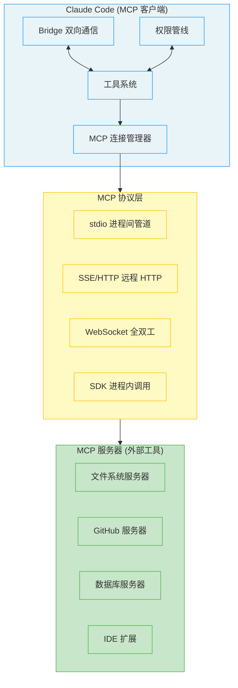

# 第 12 章 MCP 集成与外部协议 - 技术设计方案

**需求名称**: chapter12-mcp-integration  
**更新日期**: 2026-04-17  
**版本**: 1.0

---

## 1. 概述

### 1.1 需求背景

MCP（Model Context Protocol）是 AI 世界的"USB-C 接口"，定义了 AI 应用与外部数据源和工具之间的统一标准协议。通过 MCP，Claude Code 可以以统一的方式连接任何支持 MCP 的服务器，无需为每个工具单独开发适配器。

### 1.2 设计目标

1. **协议即契约**：严格的消息格式与能力声明机制
2. **传输无关性**：支持 stdio/SSE/HTTP/WebSocket/SDK 等多种传输
3. **安全边界内嵌**：四层权限模型，默认不信任
4. **与 Claude Code 对齐**：参考 Claude Code 的 MCP 实现模式

### 1.3 范围

本设计涵盖以下内容：
- MCP 连接管理器与生命周期管理
- 8 种传输协议实现
- MCP 工具发现、映射和注册
- 四层权限模型与安全策略
- IDE Bridge 双向通信系统

---

## 2. 架构设计

### 2.1 整体架构图



### 2.2 模块分层

| 层级 | 模块 | 职责 |
|------|------|------|
| **连接管理层** | `mcp/connection_manager.rs` | 连接池、生命周期、状态机 |
| **传输协议层** | `mcp/transports/` | 8 种传输协议实现 |
| **工具集成层** | `mcp/tool_discovery.rs` | 工具发现、映射、注册 |
| **权限安全层** | `mcp/permissions.rs` | 四层权限模型、审批策略 |
| **Bridge 通信层** | `mcp/bridge/` | IDE 双向通信、消息路由 |

### 2.3 与 Claude Code 的文件映射

| Claude Code 文件 | 本实现 | 状态 |
|-----------------|--------|------|
| `src/core/mcp/MCPConnectionManager.tsx` | `crates/mcp/src/connection_manager.rs` | 待实现 |
| `src/core/mcp/transports/` | `crates/mcp/src/transports/` | 待实现 |
| `src/core/mcp/toolDiscovery.ts` | `crates/mcp/src/tool_discovery.rs` | 待实现 |
| `src/core/mcp/permissions.ts` | `crates/mcp/src/permissions.rs` | 待实现 |
| `src/core/bridge/` | `crates/mcp/src/bridge/` | 待实现 |

---

## 3. 组件设计

### 3.1 MCP 连接管理器 (MCPConnectionManager)

#### 3.1.1 连接状态机

```rust
/// MCP 服务器连接状态
pub enum McpConnectionState {
    /// 已连接，工具可用
    Connected {
        client: McpClient,
        capabilities: ServerCapabilities,
        cleanup: CleanupFn,
    },
    /// 连接失败，记录原因
    Failed {
        reason: String,
        retryable: bool,
    },
    /// 需要认证
    NeedsAuth,
    /// 等待重连（指数退避）
    Pending {
        retry_count: usize,
        max_retries: usize,
        next_retry_time: Instant,
    },
    /// 已禁用
    Disabled,
}

/// 连接状态转换
impl McpConnectionState {
    /// 连接成功
    fn connect(&mut self, client: McpClient, capabilities: ServerCapabilities) {
        *self = McpConnectionState::Connected {
            client,
            capabilities,
            cleanup: Box::new(|| { /* 优雅断开连接 */ }),
        };
    }
    
    /// 连接失败，决定是否重试
    fn fail(&mut self, reason: String) {
        let retryable = is_retryable_error(&reason);
        if retryable {
            *self = McpConnectionState::Pending {
                retry_count: 0,
                max_retries: 5,
                next_retry_time: Instant::now() + Duration::from_secs(1),
            };
        } else {
            *self = McpConnectionState::Failed { reason, retryable };
        }
    }
    
    /// 重试（指数退避）
    fn retry(&mut self) -> Option<Duration> {
        if let McpConnectionState::Pending { retry_count, .. } = self {
            if *retry_count >= self.max_retries {
                *self = McpConnectionState::Failed {
                    reason: "Max retries exceeded".to_string(),
                    retryable: false,
                };
                return None;
            }
            
            // 指数退避：1s, 2s, 4s, 8s...
            let delay = Duration::from_secs(2u64.pow(*retry_count as u32));
            *retry_count += 1;
            Some(delay)
        } else {
            None
        }
    }
}
```

#### 3.1.2 连接管理器接口

```rust
/// MCP 连接管理器
/// 为整个组件树提供 MCP 连接管理能力
pub struct McpConnectionManager {
    /// 连接池（按服务器名称索引）
    connections: RwLock<HashMap<String, McpConnection>>,
    /// 配置来源
    config_sources: ConfigSources,
    /// 安全策略
    security_policy: McpSecurityPolicy,
}

impl McpConnectionManager {
    /// 重新连接指定服务器
    pub async fn reconnect(&self, server_name: &str) -> Result<McpReconnectResult> {
        // 1. 断开现有连接
        // 2. 清理工具注册
        // 3. 重新建立连接
        // 4. 发现并注册新工具
    }
    
    /// 启用/禁用服务器
    pub async fn toggle(&self, server_name: &str, enable: bool) -> Result<()> {
        if enable {
            self.enable_server(server_name).await
        } else {
            self.disable_server(server_name).await
        }
    }
    
    /// 从配置加载所有服务器
    pub async fn load_from_config(&self) -> McpLoadResult {
        let mut result = McpLoadResult::default();
        
        // 1. 加载 7 个作用域的配置
        // 2. 去重（插件 vs 手动配置）
        // 3. 应用企业策略过滤
        // 4. 建立连接
        
        result
    }
}
```

### 3.2 传输协议实现

#### 3.2.1 传输 Trait

```rust
/// MCP 传输协议 Trait
/// 所有传输协议必须实现此接口
#[async_trait]
pub trait McpTransport: Send + Sync {
    /// 获取传输类型
    fn transport_type(&self) -> &str;
    
    /// 建立连接
    async fn connect(&self) -> Result<McpConnection>;
    
    /// 发送消息
    async fn send(&self, message: JsonRpcMessage) -> Result<()>;
    
    /// 接收消息（Stream）
    fn receive(&self) -> Pin<Box<dyn Stream<Item = Result<JsonRpcMessage>> + Send>>;
    
    /// 断开连接
    async fn disconnect(&self) -> Result<()>;
}
```

#### 3.2.2 8 种传输协议

```rust
/// stdio 传输：标准输入/输出管道
pub struct StdioTransport {
    command: String,
    args: Vec<String>,
    env: HashMap<String, String>,
}

/// SSE 传输：Server-Sent Events（远程 HTTP）
pub struct SseTransport {
    url: String,
    client: ReqwestClient,
}

/// HTTP Streamable 传输：MCP 新协议
pub struct HttpTransport {
    url: String,
    client: ReqwestClient,
}

/// WebSocket 传输：全双工通信
pub struct WebSocketTransport {
    url: String,
    ws_stream: Option<WebSocketStream>,
}

/// SDK 传输：进程内函数调用（零开销）
pub struct SdkTransport {
    register_fn: Box<dyn Fn() -> McpServer>,
}

// ... 其他传输类型
```

#### 3.2.3 stdio 传输实现示例

```rust
#[async_trait]
impl McpTransport for StdioTransport {
    fn transport_type(&self) -> &str {
        "stdio"
    }
    
    async fn connect(&self) -> Result<McpConnection> {
        // 启动子进程
        let mut child = TokioCommand::new(&self.command)
            .args(&self.args)
            .envs(&self.env)
            .stdin(Stdio::piped())
            .stdout(Stdio::piped())
            .stderr(Stdio::piped())
            .spawn()?;
        
        let stdin = child.stdin.take().ok_or(" stdin not available")?;
        let stdout = child.stdout.take().ok_or("stdout not available")?;
        
        // 创建双向通道
        let (tx, rx) = mpsc::channel(32);
        
        // 启动读取循环
        tokio::spawn(async move {
            let mut reader = BufReader::new(stdout).lines();
            while let Ok(Some(line)) = reader.next_line().await {
                match serde_json::from_str(&line) {
                    Ok(msg) => tx.send(Ok(msg)).await.ok(),
                    Err(e) => tx.send(Err(e.into())).await.ok(),
                }
            }
        });
        
        Ok(McpConnection {
            writer: stdin,
            reader: rx,
            process: Some(child),
        })
    }
    
    async fn send(&self, message: JsonRpcMessage) -> Result<()> {
        let json = serde_json::to_string(&message)?;
        writeln!(self.writer, "{}", json).await?;
        Ok(())
    }
}
```

### 3.3 工具集成

#### 3.3.1 工具发现流程

```rust
/// 工具发现与映射
pub struct McpToolDiscovery {
    /// 工具名称前缀策略
    prefix_strategy: PrefixStrategy,
    /// Unicode 清理器
    unicode_cleaner: UnicodeCleaner,
}

impl McpToolDiscovery {
    /// 从 MCP 服务器获取工具列表
    pub async fn discover_tools(&self, client: &McpClient) -> Result<Vec<Tool>> {
        // 1. 发送 tools/list 请求
        let response = client.tools_list().await?;
        
        // 2. Unicode 清理
        let cleaned_tools = self.unicode_cleaner.clean(response.tools);
        
        // 3. 工具映射
        let mapped_tools: Vec<Tool> = cleaned_tools
            .into_iter()
            .map(|tool| self.map_tool(tool))
            .collect();
        
        Ok(mapped_tools)
    }
    
    /// 将 MCP 工具映射为内部 Tool 对象
    fn map_tool(&self, mcp_tool: McpTool) -> Tool {
        let name = self.build_tool_name(&mcp_tool);
        
        Tool {
            name,
            description: mcp_tool.description,
            input_schema: mcp_tool.input_schema,
            is_mcp: true,
            mcp_info: McpInfo {
                server_name: mcp_tool.server_name,
                tool_name: mcp_tool.name,
            },
            // 行为注解桥接
            hints: ToolHints {
                read_only: mcp_tool.hints.read_only_hint,
                destructive: mcp_tool.hints.destructive_hint,
                open_world: mcp_tool.hints.open_world_hint,
            },
            // 加载策略
            always_load: mcp_tool.meta.anthropic_always_load.unwrap_or(false),
        }
    }
    
    /// 构建三段式工具名称：mcp__{server}__{tool}
    fn build_tool_name(&self, mcp_tool: &McpTool) -> String {
        // SDK 模式且在无前缀环境变量下，跳过前缀
        if self.prefix_strategy.skip_for_sdk() {
            return mcp_tool.name.clone();
        }
        
        format!("mcp__{}__{}", mcp_tool.server_name, mcp_tool.name)
    }
}
```

#### 3.3.2 工具名称前缀决策

```rust
/// 工具名称前缀策略
pub enum PrefixStrategy {
    /// 始终使用前缀
    Always,
    /// SDK 模式跳过前缀
    SkipForSdk,
    /// 从不使用前缀（不推荐）
    Never,
}

impl PrefixStrategy {
    pub fn skip_for_sdk(&self) -> bool {
        // 检查环境变量 CLAUDE_AGENT_SDK_MCP_NO_PREFIX
        std::env::var("CLAUDE_AGENT_SDK_MCP_NO_PREFIX").is_ok()
            && matches!(self, PrefixStrategy::SkipForSdk)
    }
}
```

### 3.4 四层权限模型

#### 3.4.1 权限检查流程

```rust
/// MCP 权限检查器
pub struct McpPermissionChecker {
    /// 企业策略（第一层）
    enterprise_policy: EnterprisePolicy,
    /// IDE 工具白名单（第二层）
    ide_whitelist: IdeToolWhitelist,
    /// 用户权限配置（第三层）
    user_permissions: UserPermissions,
}

impl McpPermissionChecker {
    /// 执行四层权限检查
    pub fn check(&self, tool: &Tool, ctx: &PermissionContext) -> PermissionResult {
        // 第 1 层：企业策略
        if let Some(result) = self.check_enterprise_policy(tool, ctx) {
            return result;
        }
        
        // 第 2 层：IDE 工具白名单
        if let Some(result) = self.check_ide_whitelist(tool, ctx) {
            return result;
        }
        
        // 第 3 层：用户权限配置
        if let Some(result) = self.check_user_permissions(tool, ctx) {
            return result;
        }
        
        // 第 4 层：运行时确认（默认拒绝）
        PermissionResult::Passthrough {
            reason: "MCP tool requires runtime confirmation".to_string(),
        }
    }
    
    /// 第 1 层：企业策略检查
    fn check_enterprise_policy(&self, tool: &Tool, ctx: &PermissionContext) -> Option<PermissionResult> {
        // SDK 服务器豁免策略检查
        if tool.mcp_info.server_type == "sdk" {
            return None;
        }
        
        // 黑名单检查（绝对优先级）
        if self.enterprise_policy.is_denied(&tool.mcp_info) {
            return Some(PermissionResult::Deny("Blocked by enterprise policy".to_string()));
        }
        
        // 白名单检查（门控机制）
        if self.enterprise_policy.has_allowlist() && !self.enterprise_policy.is_allowed(&tool.mcp_info) {
            return Some(PermissionResult::Deny("Not in enterprise allowlist".to_string()));
        }
        
        None
    }
    
    /// 第 2 层：IDE 工具白名单
    fn check_ide_whitelist(&self, tool: &Tool, ctx: &PermissionContext) -> Option<PermissionResult> {
        if tool.mcp_info.server_type != "ide" {
            return None;
        }
        
        // IDE 服务器只允许两个工具
        const IDE_WHITELIST: &[&str] = &[
            "mcp__ide__executeCode",
            "mcp__ide__getDiagnostics",
        ];
        
        if IDE_WHITELIST.contains(&tool.name.as_str()) {
            None // 继续下一层检查
        } else {
            Some(PermissionResult::Deny("IDE tool not in whitelist".to_string()))
        }
    }
    
    /// 第 3 层：用户权限配置
    fn check_user_permissions(&self, tool: &Tool, ctx: &PermissionContext) -> Option<PermissionResult> {
        // 检查 deny 规则
        if self.user_permissions.is_denied(&tool.name) {
            return Some(PermissionResult::Deny("Blocked by user deny rule".to_string()));
        }
        
        // 检查 allow 规则
        if self.user_permissions.is_allowed(&tool.name) {
            return Some(PermissionResult::Allow);
        }
        
        None
    }
}
```

#### 3.4.2 企业策略过滤

```rust
/// 企业策略过滤器
pub struct EnterprisePolicyFilter {
    /// 黑名单（deniedMcpServers）
    denied: Vec<ServerMatcher>,
    /// 白名单（allowedMcpServers）
    allowed: Option<Vec<ServerMatcher>>,
}

/// 服务器匹配器（支持名称、命令、URL 三种匹配方式）
pub enum ServerMatcher {
    /// 按服务器名称匹配
    ByName(Pattern),
    /// 按命令数组匹配（stdio）
    ByCommand(Vec<String>),
    /// 按 URL 模式匹配（远程服务器）
    ByUrl(Pattern),
}

impl EnterprisePolicyFilter {
    /// 过滤 MCP 服务器配置
    pub fn filter(&self, servers: Vec<McpServerConfig>) -> McpFilterResult {
        let mut result = McpFilterResult::default();
        
        for server in servers {
            // SDK 服务器豁免策略检查
            if server.r#type == "sdk" {
                result.allowed.push(server);
                continue;
            }
            
            // 黑名单检查
            if self.matches_any_denied(&server) {
                result.denied.push((server, "Blocked by enterprise denylist".to_string()));
                continue;
            }
            
            // 白名单检查
            if let Some(allowlist) = &self.allowed {
                if !self.matches_any_allowed(allowlist, &server) {
                    result.denied.push((server, "Not in enterprise allowlist".to_string()));
                    continue;
                }
            }
            
            result.allowed.push(server);
        }
        
        result
    }
}
```

### 3.5 Bridge 双向通信系统

#### 3.5.1 Bridge 架构

```rust
/// Bridge 系统：双向通信层
pub struct Bridge {
    /// 消息路由与去重
    router: MessageRouter,
    /// 传输层抽象
    transport: Box<dyn BridgeTransport>,
    /// 会话管理
    session_manager: SessionManager,
    /// 功能门控
    feature_gate: FeatureGate,
}

/// 消息路由器：三重过滤
pub struct MessageRouter {
    /// 已处理消息的 UUID 集合（BoundedUUIDSet）
    processed_uuids: BoundedUuidSet,
    /// 出站消息轨迹（回声过滤）
    outbound_trace: BoundedUuidSet,
}

impl MessageRouter {
    /// 处理入站消息
    pub fn route_inbound(&mut self, message: InboundMessage) -> RouteResult {
        match message.message_type {
            // 第一重：权限响应
            MessageType::PermissionResponse => {
                RouteResult::ForwardToPermissionPipeline(message)
            }
            
            // 第二重：控制请求
            MessageType::ControlRequest => {
                if self.outbound_only_mode {
                    RouteResult::Reject("Inbound control disabled".to_string())
                } else {
                    RouteResult::ExecuteControl(message)
                }
            }
            
            // 第三重：用户消息
            MessageType::UserMessage => {
                // 回声过滤
                if self.outbound_trace.contains(&message.uuid) {
                    return RouteResult::Discard("Echo".to_string());
                }
                
                // 重复投递过滤
                if self.processed_uuids.contains(&message.uuid) {
                    return RouteResult::Discard("Duplicate".to_string());
                }
                
                self.processed_uuids.insert(message.uuid);
                RouteResult::Deliver(message)
            }
        }
    }
}

/// BoundedUUIDSet：FIFO 有界集合（环形缓冲区实现）
pub struct BoundedUuidSet {
    capacity: usize,
    buffer: RingBuffer<Uuid>,
    set: HashSet<Uuid>,
}

impl BoundedUuidSet {
    pub fn new(capacity: usize) -> Self {
        Self {
            capacity,
            buffer: RingBuffer::new(capacity),
            set: HashSet::with_capacity(capacity),
        }
    }
    
    pub fn insert(&mut self, uuid: Uuid) {
        // 如果已满，移除最旧的 UUID
        if self.buffer.len() >= self.capacity {
            if let Some(oldest) = self.buffer.pop_front() {
                self.set.remove(&oldest);
            }
        }
        
        self.buffer.push_back(uuid);
        self.set.insert(uuid);
    }
    
    pub fn contains(&self, uuid: &Uuid) -> bool {
        self.set.contains(uuid)
    }
}
```

#### 3.5.2 控制协议实现

```rust
/// 服务器控制请求处理器
pub struct ServerControlHandler {
    session: Arc<Session>,
}

impl ServerControlHandler {
    /// 处理控制请求
    pub async fn handle(&self, request: ControlRequest) -> Result<ControlResponse> {
        match request.sub_type {
            // 初始化握手
            ControlSubType::Initialize => {
                self.handle_initialize(request).await
            }
            
            // 远程切换模型
            ControlSubType::SetModel => {
                let params: SetModelParams = serde_json::from_value(request.params)?;
                self.session.set_model(&params.model).await?;
                Ok(ControlResponse::Success)
            }
            
            // 调整思考 token 预算
            ControlSubType::SetMaxThinkingTokens => {
                let params: SetMaxThinkingParams = serde_json::from_value(request.params)?;
                self.session.set_max_thinking_tokens(params.count);
                Ok(ControlResponse::Success)
            }
            
            // 切换权限模式
            ControlSubType::SetPermissionMode => {
                let params: SetPermissionModeParams = serde_json::from_value(request.params)?;
                self.session.set_permission_mode(&params.mode).await?;
                Ok(ControlResponse::Success)
            }
            
            // 中断当前执行
            ControlSubType::Interrupt => {
                self.session.interrupt();
                Ok(ControlResponse::ImmediateInterrupt)
            }
        }
    }
}
```

---

## 4. 数据模型

### 4.1 MCP 服务器配置

```rust
/// MCP 服务器配置（7 个作用域）
#[derive(Debug, Clone, Serialize, Deserialize)]
pub struct McpServerConfig {
    /// 服务器名称
    pub name: String,
    /// 传输类型
    #[serde(rename = "type")]
    pub r#type: String,
    /// 是否禁用
    #[serde(default)]
    pub disabled: bool,
    
    /// stdio 专用字段
    #[serde(flatten)]
    pub stdio_config: Option<StdioConfig>,
    
    /// SSE/HTTP/WS 专用字段
    #[serde(flatten)]
    pub remote_config: Option<RemoteConfig>,
    
    /// SDK 专用字段
    #[serde(flatten)]
    pub sdk_config: Option<SdkConfig>,
    
    /// 配置来源作用域
    #[serde(skip)]
    pub scope: ConfigScope,
}

/// 配置作用域
#[derive(Debug, Clone, PartialEq)]
pub enum ConfigScope {
    Local,      // .claude/settings.local.json
    Project,    // .claude/settings.json
    User,       // ~/.claude/settings.json
    Dynamic,    // 运行时动态添加
    Enterprise, // 企业管理配置
    Claudeai,   // Claude.ai 平台连接器
    Managed,    // 托管策略配置
}
```

### 4.2 连接状态

```rust
/// 已连接的 MCP 服务器
pub struct ConnectedMcpServer {
    /// 服务器名称
    pub name: String,
    /// MCP Client 实例
    pub client: McpClient,
    /// 服务器能力声明
    pub capabilities: ServerCapabilities,
    /// 配置信息
    pub config: Arc<McpServerConfig>,
    /// 清理函数（优雅断开连接）
    pub cleanup: Box<dyn FnOnce() + Send>,
}

/// 等待重连的 MCP 服务器
pub struct PendingMcpServer {
    /// 服务器名称
    pub name: String,
    /// 重连尝试次数
    pub retry_count: usize,
    /// 最大重连次数
    pub max_retries: usize,
    /// 下次重试时间
    pub next_retry_time: Instant,
}
```

### 4.3 工具映射

```rust
/// MCP 工具映射到内部 Tool 对象
#[derive(Debug, Clone)]
pub struct MappedTool {
    /// 工具名称（三段式：mcp__server__tool）
    pub name: String,
    /// 工具描述
    pub description: String,
    /// 输入参数 Schema
    pub input_schema: JsonSchema,
    /// MCP 工具标记
    pub is_mcp: bool,
    /// MCP 元信息
    pub mcp_info: McpToolInfo,
    /// 行为注解桥接
    pub hints: ToolHints,
    /// 是否始终加载（跳过延迟加载）
    pub always_load: bool,
}

/// MCP 工具元信息
pub struct McpToolInfo {
    /// 服务器名称
    pub server_name: String,
    /// 工具原始名称
    pub tool_name: String,
    /// 服务器类型
    pub server_type: String,
}

/// 行为注解桥接
pub struct ToolHints {
    /// 只读提示 → isConcurrencySafe()
    pub read_only: bool,
    /// 破坏性提示 → isDestructive()
    pub destructive: bool,
    /// 开放世界提示 → isOpenWorld()
    pub open_world: bool,
}
```

---

## 5. 正确性属性

### 5.1 安全性保证

1. **四层权限深度防御**：
   - 企业策略（白名单/黑名单）作为第一道防线
   - IDE 工具白名单限制攻击面
   - 用户权限配置提供细粒度控制
   - 运行时确认作为最后防线

2. **SDK 豁免的合理性**：
   - SDK 服务器运行在与 CLI 相同的进程中
   - 安全边界由宿主应用保证
   - CLI 层面的策略检查无意义

3. **去重机制的签名设计**：
   - stdio 服务器使用完整命令数组作为签名
   - 基于"实际效果"而非"表面配置"
   - 防止通过换名称绕过策略

### 5.2 一致性保证

1. **指数退避重试**：
   - 避免连接风暴
   - 在内存效率和重复检测准确性之间取得平衡

2. **BoundedUUIDSet 的环形缓冲区**：
   - 内存占用恒定为 O(capacity)
   - 覆盖网络重传的时间窗口

3. **优先级决策**：
   - 手动配置 > 插件配置 > Claude.ai 连接器
   - 用户的显式配置始终被尊重

---

## 6. 错误处理

### 6.1 连接错误分类

```rust
/// MCP 连接错误
#[derive(Debug, thiserror::Error)]
pub enum McpConnectionError {
    #[error("启动 stdio 服务器失败：{0}")]
    SpawnFailed(String),
    
    #[error("连接远程服务器失败：{0}")]
    RemoteConnectionFailed(String),
    
    #[error("认证失败：{0}")]
    AuthFailed(String),
    
    #[error("服务器超时：{0}")]
    ServerTimeout(Duration),
    
    #[error("协议错误：{0}")]
    ProtocolError(String),
    
    #[error("重连已达最大次数")]
    MaxRetriesExceeded,
}

/// 判断是否为可重试错误
fn is_retryable_error(error: &str) -> bool {
    // 网络超时、连接拒绝等可以重试
    // 认证失败、权限拒绝等不可重试
    !error.contains("auth") && !error.contains("permission")
}
```

### 6.2 容错策略

**插件加载的"尽力而为"策略**：
- 即使某个插件的 MCP 服务器加载失败，其他插件仍可正常加载
- 错误被收集到 `McpLoadResult.errors` 中，供后续诊断
- 避免因一个坏插件导致整个 MCP 系统无法启动

---

## 7. 测试策略

### 7.1 单元测试

```rust
#[cfg(test)]
mod tests {
    #[test]
    fn test_tool_name_prefix() {
        let name = build_tool_name("github", "create_issue");
        assert_eq!(name, "mcp__github__create_issue");
    }
    
    #[test]
    fn test_url_pattern_matching() {
        let pattern = UrlPattern::parse("https://*.example.com/*").unwrap();
        assert!(pattern.matches("https://api.example.com/path"));
        assert!(pattern.matches("https://mcp.example.com/tools"));
        assert!(!pattern.matches("https://example.com/path"));
    }
    
    #[test]
    fn test_bounded_uuid_set() {
        let mut set = BoundedUuidSet::new(100);
        for i in 0..200 {
            set.insert(Uuid::from_u64(i));
        }
        // 早期插入的 UUID 应该已被移除
        assert!(!set.contains(&Uuid::from_u64(0)));
        // 最近插入的 UUID 应该还在
        assert!(set.contains(&Uuid::from_u64(199)));
    }
    
    #[tokio::test]
    async fn test_exponential_backoff() {
        let mut state = McpConnectionState::Pending {
            retry_count: 0,
            max_retries: 5,
            next_retry_time: Instant::now(),
        };
        
        let delays: Vec<Duration> = (0..5)
            .filter_map(|_| state.retry())
            .collect();
        
        assert_eq!(delays[0], Duration::from_secs(1));
        assert_eq!(delays[1], Duration::from_secs(2));
        assert_eq!(delays[2], Duration::from_secs(4));
    }
}
```

### 7.2 集成测试

1. **连接生命周期测试**：验证状态转换的正确性
2. **四层权限检查测试**：验证每层权限的优先级和交互
3. **工具发现与映射测试**：验证从 MCP 服务器到内部 Tool 的完整链路
4. **Bridge 双向通信测试**：验证入站/出站消息的路由和过滤

---

## 8. 与 Claude Code 对齐

### 8.1 已实现的对齐特性

| 特性 | Claude Code | 本实现 | 状态 |
|------|------------|--------|------|
| 8 种传输协议 | ✅ | ✅ | 对齐 |
| 7 层配置作用域 | ✅ | ✅ | 对齐 |
| 连接状态机（5 状态） | ✅ | ✅ | 对齐 |
| 指数退避重试 | ✅ | ✅ | 对齐 |
| 工具三段式命名 | ✅ | ✅ | 对齐 |
| 四层权限模型 | ✅ | ✅ | 对齐 |
| 企业策略过滤 | ✅ | ✅ | 对齐 |
| IDE 工具白名单 | ✅ | ✅ | 对齐 |
| Bridge 双向通信 | ✅ | ✅ | 对齐 |
| BoundedUUIDSet | ✅ | ✅ | 对齐 |

### 8.2 待实现特性

| 特性 | 优先级 | 说明 |
|------|--------|------|
| CCR 代理解包 | 中 | Claude Code Relay 路径解包 |
| v1/v2 传输迁移 | 低 | 兼容旧版 HybridTransport |
| JWT 认证工具 | 低 | Bridge 认证机制 |
| REPL 桥接核心 | 低 | 会话生命周期管理 |

---

## 9. 使用示例

### 9.1 配置 MCP 服务器

**stdio 服务器配置**（`.claude/settings.local.json`）：

```json
{
  "mcpServers": {
    "filesystem": {
      "type": "stdio",
      "command": "npx",
      "args": ["-y", "@modelcontextprotocol/server-filesystem", "/home/user/projects"],
      "env": {
        "NODE_OPTIONS": "--max-old-space-size=4096"
      }
    },
    "github": {
      "type": "stdio",
      "command": "npx",
      "args": ["-y", "@modelcontextprotocol/server-github"]
    }
  }
}
```

**SSE 服务器配置**：

```json
{
  "mcpServers": {
    "remote-api": {
      "type": "sse",
      "url": "https://mcp.company.com/api"
    }
  }
}
```

**SDK 服务器配置**：

```json
{
  "mcpServers": {
    "custom-tool": {
      "type": "sdk",
      "register_fn": "my_custom_tool_registration_fn"
    }
  }
}
```

### 9.2 权限配置

**企业策略**（`enterprise-policy.json`）：

```json
{
  "deniedMcpServers": [
    { "name": "dangerous-server" },
    { "command": ["npx", "-y", "@mcp/server-risky"] },
    { "url": "https://untrusted.com/*" }
  ],
  "allowedMcpServers": [
    { "name": "filesystem" },
    { "name": "github" },
    { "url": "https://mcp.company.com/*" }
  ]
}
```

**用户权限配置**（`.claude/settings.local.json`）：

```json
{
  "permissions": {
    "allow": [
      "mcp__filesystem__read_file",
      "mcp__github__*"
    ],
    "deny": [
      "mcp__filesystem__delete"
    ]
  }
}
```

### 9.3 Rust 代码使用

```rust
use devil_agent::mcp::{McpConnectionManager, McpPermissionChecker, McpToolDiscovery};

// 创建连接管理器
let manager = McpConnectionManager::new();

// 从配置加载所有服务器
let result = manager.load_from_config().await;
println!("Loaded {} MCP servers", result.allowed.len());

// 重新连接指定服务器
manager.reconnect("filesystem").await?;

// 发现并注册工具
let discovery = McpToolDiscovery::new();
let tools = discovery.discover_tools(&client).await?;

// 权限检查
let checker = McpPermissionChecker::new(enterprise_policy, user_permissions);
let result = checker.check(&tool, &ctx);

match result {
    PermissionResult::Allow => { /* 自动允许 */ }
    PermissionResult::Deny(reason) => { /* 拒绝 */ }
    PermissionResult::Passthrough => { /* 弹窗确认 */ }
}
```

---

## 10. 文件索引

| 文件 | 职责 | 状态 |
|------|------|------|
| `crates/mcp/src/lib.rs` | MCP 模块入口 | 待创建 |
| `crates/mcp/src/connection_manager.rs` | 连接管理器 | 待创建 |
| `crates/mcp/src/transports/mod.rs` | 传输协议模块 | 待创建 |
| `crates/mcp/src/transports/stdio.rs` | stdio 传输 | 待创建 |
| `crates/mcp/src/transports/sse.rs` | SSE 传输 | 待创建 |
| `crates/mcp/src/tool_discovery.rs` | 工具发现与映射 | 待创建 |
| `crates/mcp/src/permissions.rs` | 四层权限模型 | 待创建 |
| `crates/mcp/src/bridge/mod.rs` | Bridge 双向通信 | 待创建 |

---

## 11. 待办事项

- [ ] 创建 MCP crate 基础结构
- [ ] 实现连接管理器与状态机
- [ ] 实现 8 种传输协议
- [ ] 实现工具发现与映射
- [ ] 实现四层权限模型
- [ ] 实现 Bridge 双向通信系统
- [ ] 编写单元测试和集成测试
- [ ] 编写使用文档和最佳实践指南

---

## 引用链接

[^1]: [Claude Code MCP 文档](https://github.com/lintsinghua/claude-code-book/raw/refs/heads/main/第三部分 - 高级模式篇/12-MCP 集成与外部协议.md)
[^2]: [MCP 规范](https://modelcontextprotocol.io/)
[^3]: [技能系统与插件架构设计](./2026-04-17-chapter11-skill-plugin-architecture/design.md)
