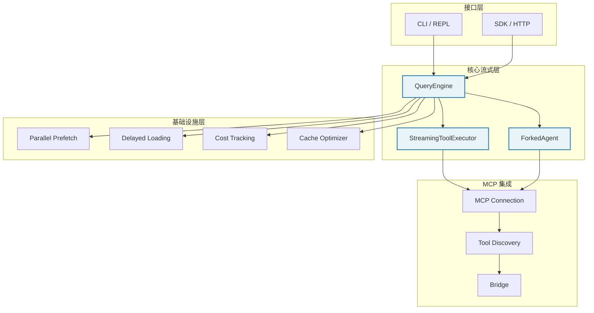
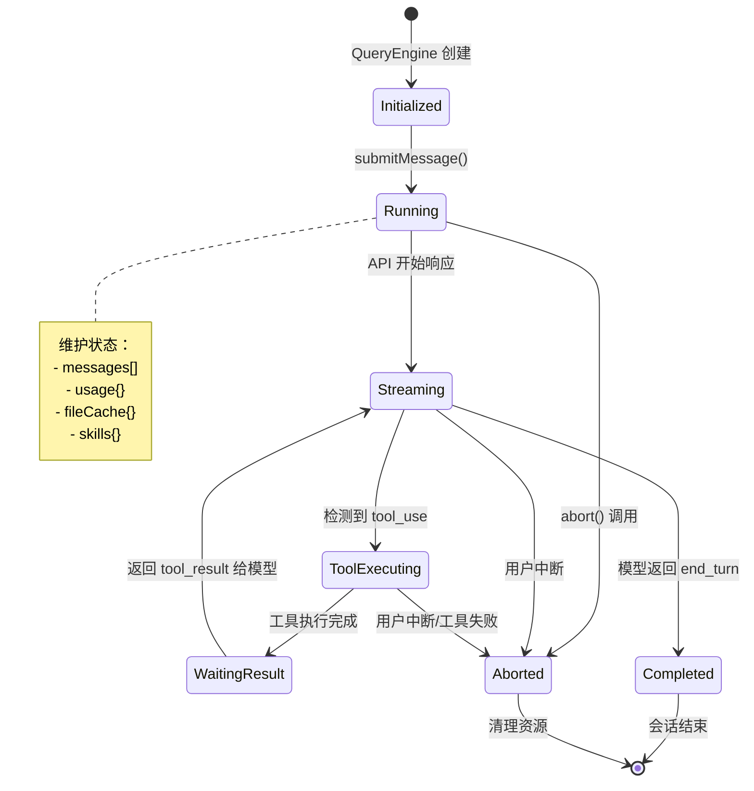

# 第 13 章：流式架构与性能优化 - 技术设计方案

更新日期：2026-04-17

## 1. 概述

### 1.1 设计目标

实现 Claude Code 级别的流式处理架构和性能优化策略，包括：

1. **流式 API 交互** - QueryEngine 管理查询生命周期，通过 AsyncGenerator 实现实时流式输出
2. **工具并发控制** - StreamingToolExecutor 实现"流到即执行"，区分并发安全/非安全工具
3. **启动性能优化** - 并行预取、延迟加载、惰性 Schema 评估，目标启动时间 < 100ms
4. **Token 成本追踪** - 流式 usage 累加，缓存命中率监控，支持预算控制
5. **缓存优化策略** - 提示缓存共享，fork 模式字节级一致性

### 1.2 参考架构

基于 Claude Code 的核心设计模式：
- `QueryEngine` - 有状态的查询生命周期管理者
- `StreamingToolExecutor` - 工具并发执行器
- `ForkedAgent` - 子任务执行器（支持缓存共享）
- 并行预取策略（MDM config + Keychain prefetch）

### 1.3 与第 12 章 MCP 的关系

- MCP 提供外部工具连接协议
- 流式架构提供工具执行和性能优化框架
- 两者结合实现完整的 Agent 执行引擎

## 2. 架构设计

### 2.1 整体架构图



### 2.2 QueryEngine 状态机



### 2.3 StreamingToolExecutor 并发模型

```mermaid
flowchart TD
    START[新工具请求] --> CHECK1{是否有<br/>工具在执行？}

    CHECK1 -->|否 | EXEC[允许执行]
    CHECK1 -->|是 | CHECK2{是否全部<br/>并发安全？}

    CHECK2 -->|是 | EXEC
    CHECK2 -->|否 | CHECK3{新工具是否<br/>并发安全？}

    CHECK3 -->|否 | QUEUE[排队等待]
    CHECK3 -->|是 | CHECK4{是否有<br/>非安全工具执行中？}

    CHECK4 -->|是 | QUEUE
    CHECK4 -->|否 | EXEC

    EXEC --> STATE_EXEC[状态：executing]
    QUEUE --> STATE_QUEUED[状态：queued]

    STATE_EXEC --> DONE[状态：completed]
    STATE_EXEC --> FAILED[状态：cancelled<br/>级联取消]

    DONE --> YIELDED[状态：yielded<br/>按序输出]
    YIELDED --> [*]

    classDef decision fill:#fff3cd,stroke:#f39c12
    classDef allow fill:#d4edda,stroke:#27ae60
    classDef deny fill:#f8d7da,stroke:#c0392b
    classDef state fill:#e8f4f8,stroke:#2980b9

    class CHECK1,CHECK2,CHECK3,CHECK4 decision
    class EXEC,ALLOW allow
    class QUEUE,DENY deny
    class STATE_EXEC,STATE_QUEUED,DONE,YIELDED,FAILED state
```

## 3. 组件与接口

### 3.1 QueryEngine 核心接口

```rust
/// QueryEngine - 查询生命周期管理者
pub struct QueryEngine {
    /// 对话历史
    messages: Vec<Message>,
    /// 中止控制器
    abort_controller: AbortController,
    /// 权限拒绝记录
    denied_permissions: HashSet<String>,
    /// 用量统计
    usage: TokenUsage,
    /// 文件状态缓存
    file_state_cache: HashMap<String, FileState>,
    /// 已发现的技能
    discovered_skills: HashSet<String>,
    /// 依赖注入
    deps: QueryDeps,
}

impl QueryEngine {
    /// 创建新的 QueryEngine
    pub fn new(deps: QueryDeps) -> Self;
    
    /// 提交消息（流式生成器）
    pub async fn submit_message(
        &mut self,
        message: String,
    ) -> Result<impl Stream<Item = StreamEvent>>;
    
    /// 中止当前查询
    pub fn abort(&self);
    
    /// 获取用量统计
    pub fn get_usage(&self) -> TokenUsage;
}

/// 流式事件类型
pub enum StreamEvent {
    /// 消息开始
    MessageStart { id: String },
    /// 内容块增量
    ContentBlockDelta {
        block_type: BlockType,
        delta: ContentDelta,
    },
    /// 消息增量（usage 更新）
    MessageDelta {
        usage: UsageDelta,
        stop_reason: Option<StopReason>,
    },
    /// 消息结束
    MessageStop,
    /// 工具调用
    ToolUse {
        id: String,
        name: String,
        input: JsonValue,
    },
}
```

### 3.2 StreamingToolExecutor 接口

```rust
/// 工具状态
pub enum ToolState {
    Queued,      // 排队等待
    Executing,   // 执行中
    Completed,   // 已完成
    Yielded,     // 已输出
    Cancelled,   // 已取消
}

/// 追踪的待执行工具
pub struct TrackedTool {
    /// 工具调用 ID
    pub id: String,
    /// 工具名称
    pub name: String,
    /// 工具参数
    pub input: JsonValue,
    /// 当前状态
    pub state: ToolState,
    /// 是否并发安全
    pub is_concurrency_safe: bool,
    /// 执行结果
    pub result: Option<ToolResult>,
}

/// 流式工具执行器
pub struct StreamingToolExecutor {
    /// 待执行工具队列
    tools: Vec<TrackedTool>,
    /// 当前正在执行的工具
    executing: Vec<String>,
    /// 兄弟工具中止控制器
    sibling_abort: AbortController,
}

impl StreamingToolExecutor {
    /// 创建新的执行器
    pub fn new() -> Self;
    
    /// 添加新工具
    pub fn add_tool(&mut self, tool: TrackedTool);
    
    /// 检查工具是否可以执行
    pub fn can_execute_tool(&self, tool: &TrackedTool) -> bool;
    
    /// 获取已完成的结果（按序输出）
    pub async fn get_completed_results(
        &mut self,
    ) -> impl Stream<Item = ToolResult>;
    
    /// 工具执行失败时级联取消
    pub fn cascade_cancel(&mut self, failed_tool_id: &str);
}
```

### 3.3 ForkedAgent 接口

```rust
/// Fork 上下文
pub struct ForkContext {
    /// 消息前缀（用于缓存命中）
    pub messages: Vec<Message>,
    /// Cache-safe 参数
    pub cache_safe_params: CacheSafeParams,
    /// 内容替换状态（克隆以保证字节级一致）
    pub content_replacement_state: ContentReplacementState,
}

/// Cache-safe 参数（缓存键五维度）
pub struct CacheSafeParams {
    /// System prompt
    pub system_prompt: String,
    /// User context
    pub user_context: String,
    /// System context
    pub system_context: String,
    /// Tool use context
    pub tool_use_context: String,
    /// Fork context messages
    pub fork_context_messages: Vec<Message>,
}

/// 运行 Forked Agent
pub async fn run_forked_agent(
    context: ForkContext,
    prompt: String,
    options: AgentOptions,
) -> Result<ForkedAgentResult>;

/// Forked Agent 结果
pub struct ForkedAgentResult {
    /// 响应消息
    pub message: String,
    /// Token 用量
    pub usage: TokenUsage,
    /// 缓存命中率
    pub cache_hit_rate: f64,
    /// 工具调用
    pub tool_calls: Vec<ToolCall>,
}
```

### 3.4 并行预取接口

```rust
/// 并行预取器
pub struct ParallelPrefetcher;

impl ParallelPrefetcher {
    /// 启动 MDM 配置预取（macOS plist / Windows registry）
    pub fn start_mdm_raw_read() -> MdmPrefetchHandle;
    
    /// 启动 Keychain 凭证预取
    pub fn start_keychain_prefetch() -> KeychainPrefetchHandle;
    
    /// 等待 MDM 预取完成
    pub async fn await_mdm(handle: MdmPrefetchHandle) -> Result<MdmConfig>;
    
    /// 等待 Keychain 预取完成
    pub async fn await_keychain(
        handle: KeychainPrefetchHandle,
    ) -> Result<(Vec<OAuthToken>, Option<LegacyApiKey>)>;
}

/// 预取句柄
pub struct MdmPrefetchHandle {
    /// 子进程句柄
    child: Option<Child>,
    /// 启动时间戳
    start_time: Instant,
}
```

### 3.5 成本追踪接口

```rust
/// Token 用量
pub struct TokenUsage {
    /// 输入 token
    pub input_tokens: u32,
    /// 输出 token
    pub output_tokens: u32,
    /// 缓存创建 token
    pub cache_creation_input_tokens: u32,
    /// 缓存读取 token
    pub cache_read_input_tokens: u32,
}

/// Usage 增量（流式事件）
pub struct UsageDelta {
    pub input_tokens: Option<u32>,
    pub output_tokens: Option<u32>,
    pub cache_creation_input_tokens: Option<u32>,
    pub cache_read_input_tokens: Option<u32>,
}

/// 更新用量（处理单条流式事件）
pub fn update_usage(
    current: &mut TokenUsage,
    delta: UsageDelta,
) {
    // > 0 守卫防止真实值被覆盖为零
    if let Some(val) = delta.input_tokens {
        if val > 0 {
            current.input_tokens += val;
        }
    }
    // ... 其他字段同理
}

/// 累加用量（跨消息）
pub fn accumulate_usage(
    total: &mut TokenUsage,
    addition: TokenUsage,
) {
    total.input_tokens += addition.input_tokens;
    total.output_tokens += addition.output_tokens;
    total.cache_creation_input_tokens += addition.cache_creation_input_tokens;
    total.cache_read_input_tokens += addition.cache_read_input_tokens;
}
```

## 4. 数据模型

### 4.1 核心数据结构

```rust
/// 消息类型
pub enum Message {
    User { content: String },
    Assistant {
        content: Vec<ContentBlock>,
        usage: Option<TokenUsage>,
    },
    ToolResult {
        tool_use_id: String,
        content: String,
        is_error: bool,
    },
}

/// 内容块类型
pub enum ContentBlock {
    Text { text: String },
    ToolUse {
        id: String,
        name: String,
        input: JsonValue,
    },
    ToolResult {
        tool_use_id: String,
        content: String,
    },
}

/// 工具并发安全属性
pub enum ConcurrencySafety {
    /// 安全 - 可并行执行
    Safe,
    /// 不安全 - 必须独占执行
    Unsafe,
}

/// 缓存命中率统计
pub struct CacheMetrics {
    /// 缓存读取 token
    pub cache_read: u32,
    /// 缓存创建 token
    pub cache_creation: u32,
    /// 普通输入 token
    pub input: u32,
    /// 命中率
    pub hit_rate: f64,
}

impl CacheMetrics {
    pub fn hit_rate(&self) -> f64 {
        if self.cache_read + self.input + self.cache_creation == 0 {
            0.0
        } else {
            self.cache_read as f64
                / (self.cache_read + self.input + self.cache_creation) as f64
        }
    }
}
```

## 5. 正确性属性

### 5.1 流式处理

- **单调递增**: Token usage 只能增加，不能减少或被覆盖
- **顺序保证**: 工具结果按添加顺序输出，Progress 消息除外
- **即时检测**: tool_use 块到达时立即准备执行

### 5.2 并发控制

- **Fail-closed**: 不确定时选择非并发安全
- **级联取消**: Bash 失败时取消所有并行兄弟
- **独立失败**: Read/WebFetch 失败不影响其他工具

### 5.3 缓存一致性

- **字节级一致**: Fork 消息前缀必须与父请求字节级相同
- **五维度匹配**: system/tools/model/prefix/thinking 全部匹配
- **监控告警**: 命中率 < 60% 触发排查

## 6. 错误处理

### 6.1 流式错误

```rust
/// 流式错误类型
pub enum StreamError {
    /// API 连接中断
    ConnectionLost,
    /// 模型返回无效数据
    InvalidResponse,
    /// Token 预算超出
    BudgetExceeded,
    /// 用户主动中断
    UserCancelled,
}
```

### 6.2 工具执行错误

```rust
/// 工具执行错误
pub enum ToolExecutionError {
    /// 工具未找到
    NotFound(String),
    /// 参数验证失败
    ValidationFailed(String),
    /// 执行失败
    ExecutionFailed(String),
    /// 级联取消
    CascadeCancelled(String),
}
```

### 6.3 恢复策略

| 错误类型 | 恢复策略 |
|----------|----------|
| 连接中断 | 指数退避重试（最多 3 次） |
| 预算超出 | 提示用户，等待确认 |
| 工具失败 | 单个失败不影响其他工具（Bash 除外） |
| 缓存断裂 | 记录日志，继续执行，不阻断 |

## 7. 测试策略

### 7.1 单元测试

- QueryEngine 状态机转换
- StreamingToolExecutor 并发控制逻辑
- usage 累加正确性（> 0 守卫）
- 缓存命中率计算

### 7.2 集成测试

- 流式工具调用端到端流程
- 并行预取效果验证
- Fork 缓存命中率验证

### 7.3 性能基准

- 启动时间 < 100ms（P95）
- 并行预取节省 > 50ms
- 缓存命中率 > 70%

## 8. 性能目标

| 指标 | 目标值 | 测量方式 |
|------|--------|----------|
| 启动时间 | < 100ms (P95) | CLI 输入到首次响应 |
| 并行预取收益 | > 50ms | 有/无预取对比 |
| 缓存命中率 | > 70% | cache_read / (input + cache_creation + cache_read) |
| 工具并发度 | 2-4 个并行 | 安全工具同时执行数 |
| Usage 追踪精度 | 100% | 与 API 账单对比误差 < 1% |

## 9. 实现计划

### Phase 1: 流式核心（2 天）
- [ ] QueryEngine 基础框架
- [ ] AsyncGenerator 流式输出
- [ ] StreamEvent 类型定义

### Phase 2: 工具执行器（2 天）
- [ ] StreamingToolExecutor
- [ ] 并发控制逻辑
- [ ] 级联取消机制

### Phase 3: 性能优化（2 天）
- [ ] 并行预取器
- [ ] 延迟加载机制
- [ ] 惰性 Schema 评估

### Phase 4: 成本与缓存（1 天）
- [ ] Usage 追踪
- [ ] Fork 缓存共享
- [ ] 缓存命中率监控

### Phase 5: 测试与集成（1 天）
- [ ] 单元测试
- [ ] 集成测试
- [ ] 性能基准

## 10. 参考链接

[^1]: Claude Code Book - 第 13 章 - https://github.com/lintsinghua/claude-code-book
[^2]: 第 12 章 MCP 设计 - `.monkeycode/specs/2026-04-17-chapter12-mcp-integration/design.md`
