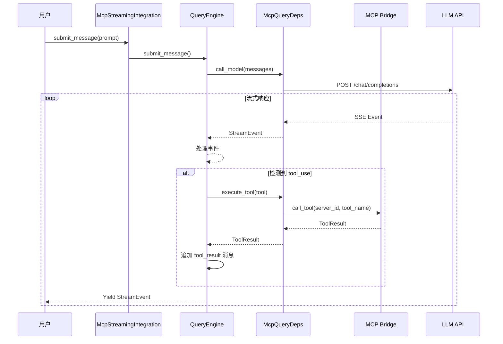
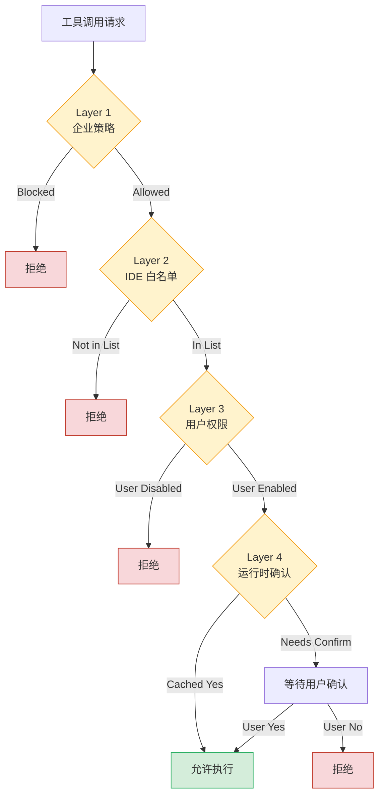

# 第 12-13 章集成文档

## MCP + Streaming 集成架构

本目录包含第 12 章 MCP 模块与第 13 章 Streaming 模块的集成实现。

### 架构图

```
┌─────────────────────────────────────────────────────────────┐
│                    Devil Agent                               │
├─────────────────────────────────────────────────────────────┤
│  主程序入口 (src/main.rs)                                    │
├─────────────────────────────────────────────────────────────┤
│  McpStreamingIntegration (集成层)                            │
│  ┌──────────────────┐  ┌──────────────────┐                │
│  │  QueryEngine     │  │ StreamingTool    │                │
│  │  (流式查询)       │  │ Executor         │                │
│  │                  │  │ (工具执行器)      │                │
│  └────────┬─────────┘  └────────┬─────────┘                │
│           │                     │                           │
│  ┌────────▼─────────────────────▼─────────┐                │
│  │          McpQueryDeps                   │                │
│  │  ┌──────────────┐  ┌────────────────┐  │                │
│  │  │ MCP          │  │ Permission     │  │                │
│  │  │ Connection   │  │ Checker        │  │                │
│  │  │ Manager      │  │ (四层权限)     │  │                │
│  │  └──────────────┘  └────────────────┘  │                │
│  └─────────────────────────────────────────┘                │
├─────────────────────────────────────────────────────────────┤
│  MCP 层 (devil-mcp crate)                                    │
│  ┌──────────────┐  ┌──────────────┐  ┌──────────────┐      │
│  │ Transports   │  │ Tool         │  │ Bridge       │      │
│  │ (8 种协议)    │  │ Discovery    │  │ (通信)       │      │
│  └──────────────┘  └──────────────┘  └──────────────┘      │
├─────────────────────────────────────────────────────────────┤
│  Streaming 层 (devil-streaming crate)                        │
│  ┌──────────────┐  ┌──────────────┐  ┌──────────────┐      │
│  │ QueryEngine  │  │ ForkedAgent  │  │ CostTracker  │      │
│  │ (状态机)     │  │ (子任务)     │  │ (成本)       │      │
│  └──────────────┘  └──────────────┘  └──────────────┘      │
│  ┌──────────────┐  ┌──────────────┐  ┌──────────────┐      │
│  │ Prefetch     │  │ Cache        │  │ Streaming    │      │
│  │ (并行预取)   │  │ Optimizer    │  │ Executor     │      │
│  └──────────────┘  └──────────────┘  └──────────────┘      │
└─────────────────────────────────────────────────────────────┘
```

## 使用示例

### 1. 创建集成环境

```rust
use devil_streaming::mcp_integration::McpStreamingIntegration;
use std::sync::Arc;

// 创建组件
let mcp_manager = Arc::new(McpConnectionManager::new());
let permission_checker = Arc::new(PermissionChecker::new(
    EnterprisePolicy::default(),
    IdeWhitelist::default(),
    UserPermissions::default(),
));
let tool_discoverer = Arc::new(ToolDiscoverer::new());

// 创建集成环境
let mut integration = McpStreamingIntegration::new(
    mcp_manager,
    permission_checker,
    tool_discoverer,
);

// 初始化（发现 MCP 工具）
let tools = integration.initialize().await?;
println!("Discovered {} tools", tools.len());
```

### 2. 执行流式查询

```rust
let engine = integration.get_query_engine().unwrap();

// 提交消息（流式）
let mut stream = engine.submit_message("帮我分析一下项目结构".to_string()).await?;

// 处理流式事件
while let Some(event) = stream.next().await {
    match event {
        StreamEvent::ContentBlockDelta { delta, .. } => {
            print!("{}", delta.text());
        }
        StreamEvent::ToolUse { name, input, .. } => {
            println!("\nTool call: {} {:?}", name, input);
        }
        _ => {}
    }
}
```

### 3. MCP 工具调用

```rust
// 通过 McpQueryDeps 执行 MCP 工具
let deps = McpQueryDeps::new(mcp_manager, permission_checker, tool_discoverer);

// 执行工具
let result = deps.execute_mcp_tool(
    "read_file",
    serde_json::json!({"path": "/tmp/test.txt"}),
).await?;

println!("Tool result: {}", result);
```

### 4. 并发工具执行

```rust
let mut executor = StreamingToolExecutor::new();

// 添加并发安全工具（Read + Grep）
executor.add_tool(TrackedTool::new("read-1", "read_file", ..., true)).await;
executor.add_tool(TrackedTool::new("grep-1", "grep", ..., true)).await;

// 两者并行执行

// 添加非并发安全工具（Bash）
executor.add_tool(TrackedTool::new("bash-1", "bash", ..., false)).await;

// Bash 独占执行，其他工具等待
```

## 核心组件

### McpQueryDeps

实现 `QueryDeps` trait，将 QueryEngine 与 MCP 集成：

- `initialize_mcp_tools()` - 从 MCP 服务器发现工具
- `execute_mcp_tool()` - 执行 MCP 工具（带权限检查）
- `call_model()` - 调用 LLM API（待实现）

### McpToolConverter

工具转换工具类：

- `to_tracked_tool()` - MCP 工具 -> TrackedTool
- `is_tool_safe()` - 判断工具并发安全性
- `result_to_mcp_format()` - 工具结果转 MCP 格式

### McpStreamingIntegration

集成环境入口：

- `initialize()` - 初始化所有组件
- `discover_tools()` - 发现 MCP 工具
- `get_query_engine()` - 获取 QueryEngine
- `get_tool_executor()` - 获取工具执行器

## 数据流



## 权限检查流程



## 性能优化

### 并行预取

在启动时并行预取：
- MDM 配置读取（macOS plutil / Windows reg query）
- Keychain 凭证（OAuth token + API key）

优化收益：节省启动时间 > 50ms

### 缓存共享

ForkedAgent 使用 cache-safe params 保证缓存命中率：
- system_prompt 一致性
- tools 列表一致性
- model 一致性
- messages prefix 一致性
- thinking config 一致性

目标：缓存命中率 > 70%

### 成本追踪

- updateUsage: >0 守卫防止覆盖真实值
- accumulateUsage: 跨消息累加
- CostTracker: 预算预警（50%/80%/95%/100%）

## 测试

### 运行单元测试

```bash
cargo test -p devil-streaming
```

### 运行集成测试

```bash
cargo test --test integration_test
```

### 运行 MCP 集成测试

```bash
cargo test -p devil-streaming mcp_integration
```

## 相关文档

- 第 12 章设计：`.monkeycode/specs/2026-04-17-chapter12-mcp-integration/design.md`
- 第 13 章设计：`.monkeycode/specs/2026-04-17-chapter13-streaming-performance/design.md`
- MCP README: `crates/mcp/README.md`
- Streaming README: `crates/streaming/README.md`

## 下一步

1. **实现真实 LLM 调用** - 连接 Anthropic API
2. **E2E 测试** - 完整对话流程测试
3. **性能基准** - 启动时间/缓存命中率/并发度测量
4. **生产优化** - 错误恢复/连接池/重试机制
