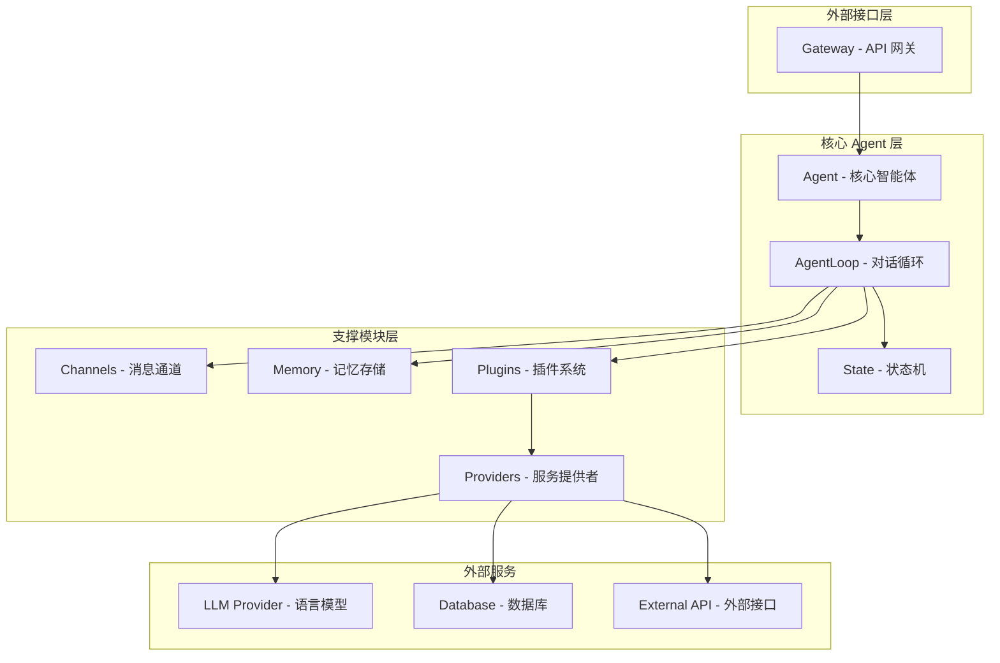
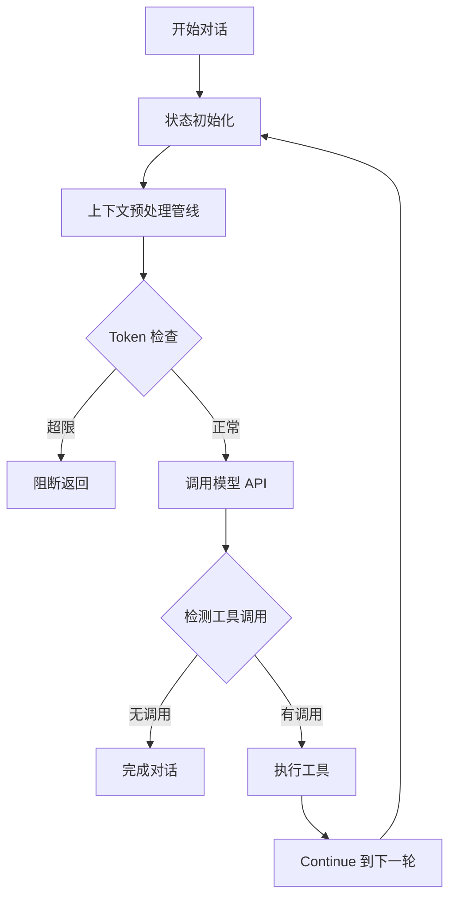
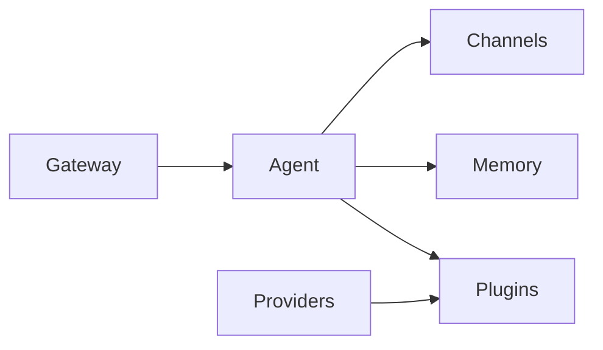

# MonkeyCode AI Agent 框架

基于 Claude Code 架构实现的高性能 AI Agent 框架，采用 Rust 语言编写，提供模块化、可扩展的智能体解决方案。

## 项目概述

本项目是一个完整的多 crate Rust workspace，实现了基于异步生成器模式的 AI Agent 核心框架。架构借鉴了 Claude Code 的设计理念，包含对话循环、状态转换、依赖注入、上下文压缩等核心功能模块。

### 核心特性

- **异步生成器驱动**：基于 `while(true)` 无限循环的对话主循环，支持流式输出和背压控制
- **状态转换模型**：细粒度的状态机设计（State → Continue/Terminal），每次转换都创建新实例确保不可变性
- **依赖注入模式**：通过 `QueryDeps` trait 实现可测试的架构，避免模块级 mock 样板代码
- **七步上下文压缩管线**：工具结果预算 → Snip → MicroCompact → Context Collapse → AutoCompact
- **工具系统**：完整的工具注册表、权限控制、并发执行和流式结果处理
- **插件机制**：可扩展的插件系统，支持热插拔功能模块
- **多通道通信**：广播通道和点对点通道的混合消息传递机制

## 架构图



### 对话循环流程



## 项目结构

```
/workspace
├── Cargo.toml              # Workspace 根配置
├── README.md               # 项目说明
└── crates/
    ├── agent/              # 核心 Agent 实现
    │   ├── src/
    │   │   ├── lib.rs      # 模块导出
    │   │   ├── core.rs     # Agent 和 AgentLoop
    │   │   ├── state.rs    # 状态转换机
    │   │   ├── deps.rs     # 依赖注入接口
    │   │   ├── context.rs  # 上下文管理
    │   │   ├── tools.rs    # 工具系统
    │   │   ├── message.rs  # 消息类型
    │   │   └── config.rs   # 配置管理
    │   └── Cargo.toml
    ├── channels/           # 消息通道
    │   ├── src/
    │   │   └── lib.rs
    │   └── Cargo.toml
    ├── memory/             # 记忆存储
    │   ├── src/
    │   │   └── lib.rs
    │   └── Cargo.toml
    ├── plugins/            # 插件系统
    │   ├── src/
    │   │   └── lib.rs
    │   └── Cargo.toml
    ├── providers/          # 服务提供者
    │   ├── src/
    │   │   └── lib.rs
    │   └── Cargo.toml
    └── gateway/            # API 网关
        ├── src/
        │   └── lib.rs
        └── Cargo.toml
```

## Crate 依赖关系



| Crate | 依赖 | 职责 |
|-------|------|------|
| `channels` | 无 | 消息通道和通信机制 |
| `memory` | 无 | 短期/长期记忆存储 |
| `plugins` | 无 | 插件接口和管理器 |
| `providers` | plugins | 外部服务提供者实现 |
| `agent` | channels, memory, plugins | 核心 Agent 逻辑 |
| `gateway` | channels, agent | HTTP API 网关 |

## 快速开始

### 环境要求

- Rust 1.70+ (Edition 2021)
- Tokio 异步运行时
- 可选：Anthropic API Key（用于真实模型调用）

### 构建项目

```bash
# 克隆仓库
git clone <repository-url>
cd <project-directory>

# 构建所有 crate
cargo build

# 运行测试
cargo test

# 生成文档
cargo doc --open
```

### 基本使用示例

```rust
use agent::{Agent, AgentConfig, Message};

#[tokio::main]
async fn main() -> anyhow::Result<()> {
    // 创建 Agent 配置
    let config = AgentConfig::builder()
        .name("my-agent")
        .model("claude-sonnet-4-20250514")
        .system_prompt("你是一个有帮助的 AI 助手")
        .max_turns(50)
        .build();
    
    // 创建 Agent 实例
    let agent = Agent::new(config)?;
    agent.initialize().await?;
    
    // 注册工具
    agent.register_tool(MyCustomTool::new()).await?;
    
    // 执行单次对话
    let user_message = Message::user_text("请帮我分析这个文件");
    let result = agent.run_once(user_message).await?;
    
    println!("对话完成：{} 轮", result.turn_count);
    
    // 关闭 Agent
    agent.shutdown().await?;
    Ok(())
}
```

## 核心概念

### 1. 对话循环（Agent Loop）

Agent 的核心是一个 `while(true)` 无限循环，每次迭代包含：

1. **状态初始化**：从 State 对象解构当前变量
2. **上下文预处理**：执行七步压缩管线
3. **API 调用**：调用模型生成响应
4. **工具检测与执行**：解析并执行工具调用
5. **状态转换**：创建新 State 继续循环或返回 Terminal

### 2. 状态转换（State Transition）

状态机采用不可变设计，每次 `continue` 都创建新的 State 实例：

```rust
// 当前状态
let current_state = State { turn_count: 0, ... };

// 转换到下一状态（创建新实例）
let next_state = current_state.next(
    ContinueReason::NextTurn,
    new_messages,
);
// next_state.turn_count == 1
```

终止原因包括：`Completed`, `MaxTurns`, `BlockingLimit`, `ModelError` 等。

### 3. 依赖注入（Dependency Injection）

通过 `QueryDeps` trait 实现依赖注入：

```rust
#[async_trait]
pub trait QueryDeps: Send + Sync {
    async fn call_model(&self, params: ModelCallParams) -> Result<ModelCallResult>;
    async fn micro_compact(&self, messages: Vec<Message>) -> Result<CompactResult>;
    async fn auto_compact(&self, messages: Vec<Message>) -> Result<CompactResult>;
    fn generate_uuid(&self) -> String;
}
```

测试时可注入 `TestDeps` 自定义行为：

```rust
let test_deps = Arc::new(TestDeps::new(
    |params| Ok(ModelCallResult { ... }),  // 自定义模型调用
    |msgs| Ok(CompactResult { ... }),      // 自定义压缩逻辑
    |msgs| Ok(CompactResult { ... }),
    || "fixed-uuid".to_string(),
));
let agent = Agent::with_deps(config, test_deps);
```

### 4. 上下文压缩管线

七步压缩策略按顺序执行：

| 步骤 | 名称 | 说明 |
|------|------|------|
| 1 | Tool Result Budget | 截断或持久化过大的工具结果 |
| 2 | Snip | 粗暴截断消息内容 |
| 3 | MicroCompact | 轻量压缩，复用 API 缓存 |
| 4 | Context Collapse | 细粒度折叠连续消息 |
| 5 | System Prompt 组装 | 添加动态上下文 |
| 6 | AutoCompact | 全量摘要历史对话 |
| 7 | Token 阻断检查 | 验证是否超限 |

## 文档导航

- [架构设计文档](.monkeycode/docs/architecture.md) - 详细架构说明
- [Crate 参考](.monkeycode/docs/crates.md) - 各 crate 职责和 API
- [快速开始指南](.monkeycode/docs/getting-started.md) - 开发环境搭建

## 许可证

MIT License
